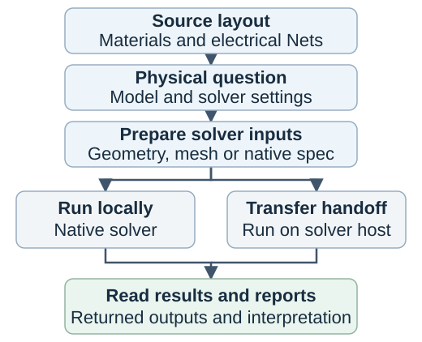

# SCGSim

SCGSim is a Python toolkit for electromagnetic modeling of superconducting
circuits. It connects named layout geometry and material facts to Palace or
Ansys Electronics Desktop, then helps you read the returned capacitance,
resonance, network and energy-participation results.

SCGSim is an independent downstream project derived from
[gsim](https://github.com/gdsfactory/gsim). It maintains its own in-tree geometry
builder and solver APIs; it is not an official gsim distribution.

## What you can do

- **Describe a model by meaning.** Assign named component Entities to electrical
  Nets and prepare a GeometryPlan snapshot with its material stack and vacuum region.
- **Preserve authored curved boundaries.** Component source may declare lines,
  arcs, interpolation splines, or B-splines, or explicitly request a GDS
  boundary reconstruction. Polygon-only source remains polygonal.
- **Choose the physical question.** Extract capacitance, find resonant modes,
  calculate a port response, or extract conductor matrices.
- **Control Palace mesh representation.** Select the 3D mesher, thread settings,
  and geometric order independently of the finite-element order, then inspect
  the detached mesh summary.
- **Study energy and loss.** Inspect surface, bulk and junction/port
  participation, and change loss assumptions without repeating an available field solve.
- **Move computation to its host.** Prepare portable solver inputs locally,
  run explicitly on an AEDT workstation or Palace local/HPC host, and load the return.
- **Read results in context.** Keep units, port/conductor order, mode identity,
  numerical history and available cost information beside the physics.

Palace Routes A and B lower explicit curve intent. Curved Route C and AEDT
curve lowering are unsupported; polygon-only inputs retain their existing
behavior.

## Choose a calculation

| Question | SCGSim workflow | Main quantity | Typical use |
|---|---|---|---|
| How strongly do conductors couple electrically? | Palace Electrostatic or AEDT Q3D | Capacitance matrix, F | Circuit capacitance and electrostatic coupling |
| Where are the resonances and their energy? | Palace Eigenmode or HFSS Eigenmode | Frequency, Hz; participation, dimensionless | Resonators and linearized junction circuits |
| What is the response between ports? | HFSS Driven Modal or Terminal | Complex S-parameters versus frequency | Transmission, reflection and coupling |
| What are the conductor matrices of a finite model? | AEDT Q3D | Native C/G and RL extraction matrices, with reported units | Finite interconnect extraction |
| What are the properties per unit length? | AEDT Q2D | C/G/L/R per length | Transmission-line cross sections |

Palace Driven and Magnetostatic are not implemented in SCGSim. Native solver
features beyond the [supported workflows](docs/backend-support.qmd) are not
made available merely by installing that solver.

## From model to results

## Start with a complete example

The public SimplePad model is a 200 µm square pad surrounded by Ground, with a
20 µm gap, on a single silicon die. Its east-edge sheet locates the modeled
junction/port; it is not a galvanic metal bridge.

*OrPen SC PDK SimplePad: 0.2 µm aluminum on 500 µm silicon. Diagnostic layout
preview, not a computed field or solver result.*

[Install the tools](docs/course/installation.qmd), then choose the
[capacitance](docs/tutorials/capacitance.qmd) or
[resonance/EPR](docs/tutorials/resonance-epr.qmd) example in the
[Getting Started course](docs/examples.qmd).
The course explains preparation, explicit execution and result reading in one
sequence. Python scripts and notebooks use the same public APIs; notebooks are
a convenient interface rather than a required runtime.

Explore the [OrPen SimplePad model and notebooks](https://github.com/OrPenStrike/orpen-sc-pdk/tree/51985d9507025e8241205712e866c0b804de29b9/notebooks/ComponentSimulation/SimplePad).

Palace needs its native executable on the solver host. AEDT workflows need
AEDT 2024.2, PyAEDT 1.3.0 and a suitable license. Installing a Python extra does
not install a solver. The preparation, solver and analysis computers may be
one machine or separate hosts.

## Understand the model

Read [problem choices](docs/concepts/problems.qmd),
[semantic geometry](docs/concepts/geometry.qmd),
[energy participation and loss](docs/eigenmode-epr.qmd), and
[boundaries and numerical interpretation](docs/concepts/model-and-numerics.qmd).
Exact interfaces belong to the Contract reference. Repository contributors can
use the separate [maintainer guide](docs/ownership.qmd).
