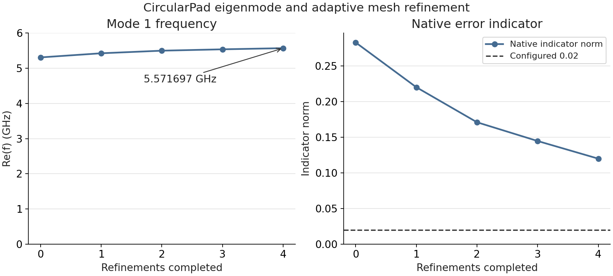

Prerequisite: the shared `snapshot` from
[source observations](source-observations.qmd) and the Palace preparation
extra. Eigenmode asks for resonances of the configured field model. It does not
require a surface-loss model, junction port or EPR request merely to run.

```python
from pathlib import Path
from IPython.display import display
from scgsim.palace import EigenmodeSim

sim = EigenmodeSim()
sim.set_plan(snapshot)
sim.set_output_dir(Path(".artifacts/public-xmon-palace-modes"))
sim.set_eigenmode(num_modes=2, target=2e9, tolerance=1e-6, save=0)
sim.set_mesh(refined_mesh_size=5.0, max_mesh_size=300.0)
display(sim.input_summary())
```

Use `set_mesh(...)` to choose `algorithm_3d`, `threads`, `surface_threads`,
`geometry_order`, and `high_order_optimize`. Geometric order controls the mesh
representation; FEM order remains a separate numerical setting. Initial values
and update behavior are in the shared
[Palace mesh contract](../specs/palace-electrostatic-sgb.qmd#palace-mesh-controls-110-candidate).

These are explicit example controls: target is in hertz and mesh sizes are in
micrometres. Choose them in relation to the mode and quantities your
SCQ study needs, and retain the chosen settings and any later changes in the
study notes. `save` controls native saved-field output. Your study may
set numerical order, solver, AMR and output controls with `set_numerical()`;
record them beside the action they govern rather than hiding them in notebook
helpers. The generated `Nonconformal` key defaults to false in SCGSim; native
Palace defaults must not be substituted silently.

Read the summary's configured mode/search/resource choices against your study.
It displays normalized source and settings without meshing or solving. The
vacuum envelope came from the plan, and the unspecified external Eigenmode
surface retains Palace's natural PMC condition. That differs from the default
Perfect E exterior in the AEDT EPR model.

## Build the real backend inputs

```python
mesh_path = sim.mesh()
config_path = sim.write_config()
print(mesh_path, config_path)
```

After meshing, `sim.mesh_summary()` exposes detached generation observations.
For Eigenmode it also reports a topological Nédélec degree-of-freedom estimate
for the configured FEM order. This estimate is not the solver's actual DOF
count; changing FEM order refreshes it without regenerating the mesh.

Meshing lowers source geometry through `scgsim.geometry.compiler` to a conformal model and
actual Gmsh mesh. The finite-metal PEC shell excludes conductor interiors from
Palace solution domains. Config writing uses the resulting exact mesh/index
identity. Changing source geometry or mesh controls invalidates derived state;
prepare a new snapshot when the shared source changes rather than overriding
only its stack or envelope.

At this point you have no eigenfrequency result. Continue to
[solver observations](solver-observations.qmd) and
[explicit execution](execute.qmd), then
[returned result resolution](returned-results.qmd). Read the requested mode
frequency and any selected participation history for the
[intended SCQ use](returned-results.qmd#interpret-for-scq-use), with native
criteria/status retained. An eigenpair residual or AMR indicator describes its
own native quantity; it does not by itself establish adequacy of the frequency
or EPR contribution you plan to use.

On return, the report retains a native `eig.csv` `Q=+inf` as
**native-reported infinite Q**. Its finite Q-based view is unavailable. Keep
that native observation separate from a physical lossless-model claim; it
does not replace a missing loss assumption or determine a device lifetime.
Other otherwise valid frequency and energy channels remain readable under
their existing contracts. The [native Q contract](../specs/palace-eigenmode.qmd#native-eigenmode-q)
defines this narrow allowance; other columns and NaN/negative infinity remain
subject to their current policies.

For the public Xmon with an inductive source port and attributed thin films,
use the [Palace EPR extension](../tutorial-xmon-palace.qmd) **before** meshing
and handoff preparation. Its surface/bulk/port selections filter reported
quantities; they do not delete physical domains or change normalization.
The [EPR concept](../eigenmode-epr.qmd) explains the quantities you will later
interpret, including why signed native port participation differs from AEDT's
nonnegative junction participation.

## Circular Pad LC study

The current public OrPen lesson is revision
[`ecc9062`](https://github.com/OrPenStrike/orpen-sc-pdk/tree/ecc90623b62e55f95afaa5a1f1048a71f81cae52): the
[canonical source lesson](https://github.com/OrPenStrike/orpen-sc-pdk/blob/ecc90623b62e55f95afaa5a1f1048a71f81cae52/notebooks/src/ComponentSimulation/CircularPad/palace_eigenmode.qmd),
its [derived notebook](https://github.com/OrPenStrike/orpen-sc-pdk/blob/ecc90623b62e55f95afaa5a1f1048a71f81cae52/notebooks/ComponentSimulation/CircularPad/palace_eigenmode.ipynb),
and [Fresh08 result evidence](https://github.com/OrPenStrike/orpen-sc-pdk/blob/ecc90623b62e55f95afaa5a1f1048a71f81cae52/notebooks/ComponentSimulation/CircularPad/evidence/README.md).
The source defines a 100 µm pad radius and 20 µm radial gap on a single-die
stack with 500 µm Si and 0.2 µm Al. It authors a 2 µm-wide east-facing
junction port and declares a linear 10 nH inductive branch with C=0 (no added
capacitive branch). The
[installation lesson](installation.qmd#select-the-curved-source-cell) shows
the current source selection. The published result is a later teaching
revision; its actual execution inputs are identified below.

::: {.callout-note title="Native Palace for this curved Uniform port"}
Configure the native Palace executable for this study from [revision
`4e9e1b7`](https://github.com/arfiligol/palace/tree/4e9e1b7232b4c8ca8b964be7e70f1848f578de37),
or a descendant containing the [curved-port extent correction](https://github.com/arfiligol/palace/blob/4e9e1b7232b4c8ca8b964be7e70f1848f578de37/palace/utils/geodata_impl.cpp).
The SCGSim Python extra does not replace the native executable; see the
[installation instructions](installation.qmd#native-palace-for-this-curved-uniform-port).
This study launches 8 MPI processes × 1 OpenMP thread through a native MPI
wrapper; a direct ELF is not an interchangeable wrapper command. This native
prerequisite applies to this curved Uniform-port example.
:::

The preparation path carries the authored curves through Palace Route B. Its
mesh settings use HXT, geometric order 2 and one `HighOrder` optimization.
These describe the mesh geometry. Palace FEM order 2 is a separate field
approximation setting; the configured maximum of four AMR passes limits the
allowed adaptation work and does not mean four passes completed.

### Read and continue the returned study

Fresh08 completed one native execution, four refinements and five
solve/estimate snapshots. Receipt-bound Resolve selected the complete final
snapshot and the existing Report completed. The final mode-1 frequency is
**5.573354161115 GHz**. The frequency history and native indicator are shown
in the figure and [frequency/AMR CSV](https://github.com/OrPenStrike/orpen-sc-pdk/blob/ecc90623b62e55f95afaa5a1f1048a71f81cae52/notebooks/ComponentSimulation/CircularPad/evidence/frequency_amr.csv).

{#fig-circular-pad-frequency-amr}

The final indicator is **0.1186681863426** against the configured **0.02**.
Palace stopped after the configured four refinements, not after demonstrating
the tolerance; this comparison is an observation, not an adequacy criterion.
All five postprocessing phases emitted two PCG nonconvergences at 10000
iterations, and the initial external attributes 11 and 3 retained a natural
PMC/ZeroCharge warning. Exit zero and strict Resolve do not remove these
warnings or establish mesh convergence.

The notebook opens with `WORKFLOW_ACTION = "analyze_handoff"`, which reads
retained run artifacts that are not included with the public bundle. To
prepare your own model, select `prepare_handoff`; select `run` to prepare and
launch Palace with a fresh `RUN_ID`. The native Palace executable is installed
separately, as described above. The result has nine surface, two bulk and one
junction contribution. Its [typed EPR CSV](https://github.com/OrPenStrike/orpen-sc-pdk/blob/ecc90623b62e55f95afaa5a1f1048a71f81cae52/notebooks/ComponentSimulation/CircularPad/evidence/typed_epr.csv)
preserves Palace's signed convention: the junction value is
**−0.9948401783541** (`signed_palace=true`), not absolute-valued or interpreted
as negative physical stored energy. The surface values are unmasked,
zero-inset baselines; LiteratureCentral loss inputs are synthetic assumptions,
not measured process properties. Known-loss outputs are not device Q/T1; see
the [EPR concept](../eigenmode-epr.qmd) for interpretation.

::: {.callout-note title="Uniform port model"}
The lumped port uses one constant +x direction and equivalent width
$w=A/l$, where $A$ is the port patch area and $l$ its extent along that
direction. This uniform projection is not the exact local voltage across the
curved gap or an equipotential-terminal voltage. The declared 10 nH is a
circuit-model input, not a measured inductance.
:::

::: {.callout-note title="Native run details" collapse="true"}
Final metadata records 846008 ND unknowns and 114197 tetrahedra, using
8 MPI processes × 1 OpenMP thread. One source-bound Pad MA sidewall cell in a
separately hashed surviving final-boundary VTU showed local non-affine
coordinates after refinement. The VTU piece is not listed in the strict
returned receipt, and one cell does not establish exact R100 fidelity, global
geometry accuracy or shared-node motion; details are in the
[public evidence page](https://github.com/OrPenStrike/orpen-sc-pdk/blob/ecc90623b62e55f95afaa5a1f1048a71f81cae52/notebooks/ComponentSimulation/CircularPad/evidence/README.md).
:::

## Execution provenance

Fresh08 used the frozen OrPen `c79b91ef882079d937fce20129f3cbd477e8438d`
producer export and SCGSim wheel SHA-256
`925a096b4ae247fddc2ac357cdf8025979f50463721312a808ff4cefafc35b40`; its
runtime bytes match public SCGSim develop commit
`2eed1eb4a9bcc7b1b020feb4953d5ed27e7d7b71` (`1.1.0rc1`, installable develop
revision, not a stable release). The native Palace source was
`4e9e1b7232b4c8ca8b964be7e70f1848f578de37`; its CLI version was not identified.
The later OrPen checkpoint `1590199` and this published lesson revision
`ecc9062` were not Fresh08 execution inputs. The [public run manifest](https://github.com/OrPenStrike/orpen-sc-pdk/blob/ecc90623b62e55f95afaa5a1f1048a71f81cae52/notebooks/ComponentSimulation/CircularPad/evidence/run_set.json)
binds the detailed source and artifact identities.
