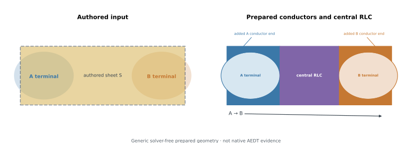
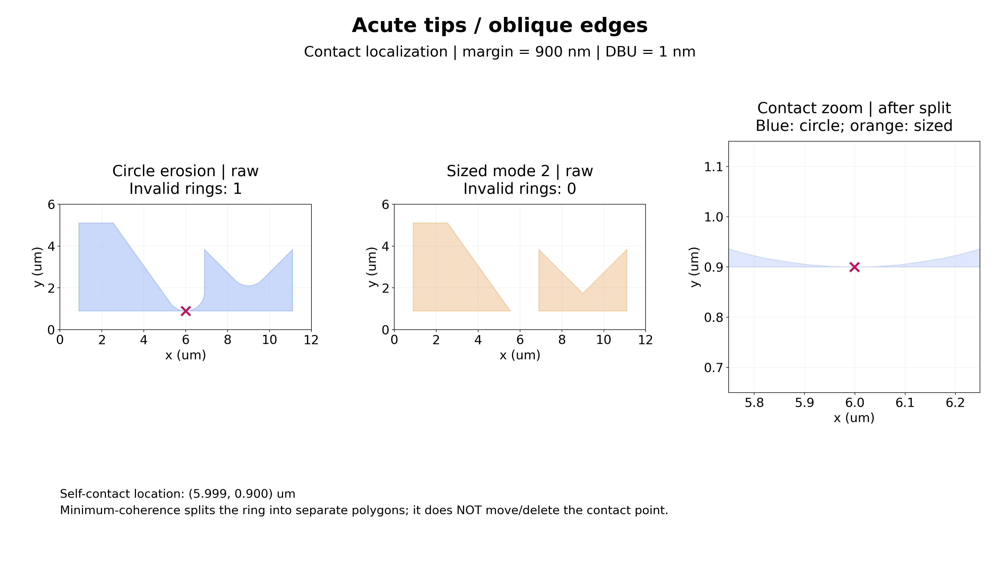
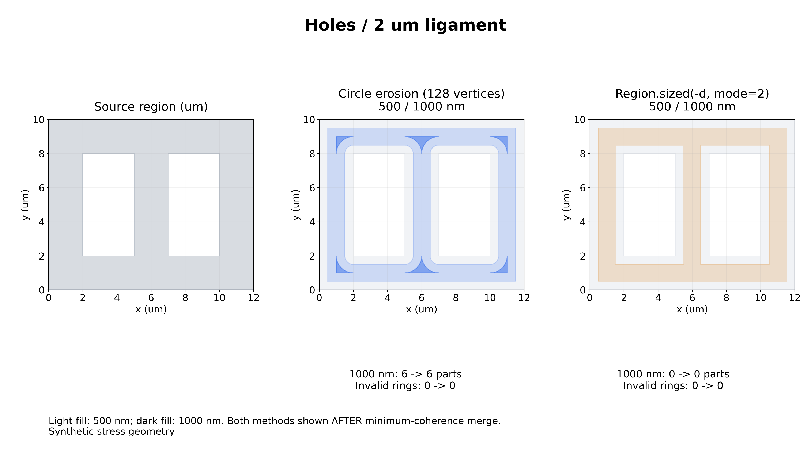

The [course map](../examples.qmd) links every implemented AEDT family lesson. This page owns exact specifications, failure rules and historical reader contracts.

::: {.callout-note title="CONVERGING candidate contract"}
HFSS Driven Terminal/Modal, HFSS Eigenmode, Q3D, and Q2D have live run and
strict resolve evidence. The scope remains converging rather than V1 stable.
:::

## One shared lifecycle

SCGSim owns one portable AEDT lifecycle:

```text
PDK geometry and material identities
-> immutable handoff
-> explicit local execution
-> native AEDT readback
-> hashed receipt
-> strict result resolution
```

The lifecycle fixes AEDT 2024.2 and PyAEDT 1.3.0, copies all required inputs,
opens a new AEDT Desktop only on explicit execution, saves and releases the
owned project, and fails closed on missing native evidence or result bytes.
The package permits Python 3.12 and 3.13 with this unchanged PyAEDT pin;
interpreter compatibility and native AEDT expression correctness are separate
claims.
PDK superconductors lower to PEC without replacing their source-material
identity. Native HFSS solids use the `pec` material with Solve Inside disabled;
native HFSS sheets use the `SCGSimPEC` Perfect E boundary. Completion requires
fresh native object-type, material or boundary-type, assignment, and complete
face-coverage readback. Other materials reference exact PDK-provided AEDT
library names; SCGSim does not invent numeric material properties.

The public lifecycle has one transaction owner and three private family
pipelines:

```text
run.py: validate cohort -> write running receipt -> own Desktop -> dispatch
family: prepare native model -> solve explicit setup -> export/read back
run.py: release Desktop -> write final receipt
```

The normal command and diagnostic instrumentation use the same private family
preparation functions. The EPR candidate adds `--execute --prepare-only`
through this same transaction and native builder. It saves and reads back the
prepared model, releases the owned Desktop, and reports
`native_preparation_only` with `solver_invoked=false`; it is a native
preparation, not a mock solve. The ordinary one-shot families keep their
existing solve/export behavior and do not acquire a second Desktop owner.

Each family binds its request once before native preparation. The private bound
request fixes the absolute run workspace and a detached immutable spec payload;
relative spec paths remain relative to that workspace across later `chdir`,
while absolute source paths retain their lexical identity. Family preparation
parses only the bound payload, then returns a carrier containing the native app
handle and detached preparation readback. Solve and export accept only that
carrier. Export helpers work on separate copies, so helper failure or mutation
of a returned result cannot alter the preparation evidence retained by the
carrier.

Project names have two explicit representations. Direct Python authoring keeps
the existing filename normalization: a supplied filename loses its final
suffix. The canonical JSON payload stores the already-normalized project name,
so parsing and serializing that payload repeatedly preserves it byte-for-byte,
including internal dots and text that itself ends in `.aedt`. Handoff
preparation copies that canonical name unchanged and binds only the copied GDS
path in its independent payload. It does not reinterpret old truncated names,
rewrite existing artifacts, or provide a legacy-name fallback.

## Receipt cohorts and source provenance

New handoffs retain `scgsim.aedt.handoff.v1` and
`scgsim.aedt.handoff-manifest.v1`. Both records add
`expected_receipt_schema: scgsim.aedt.receipt.v3`, and the initial receipt is
V3. It contains `prepared_runtime_source`: a deterministic, sorted
`runtime-source.v8` manifest of the SCGSim transaction, family, common, spec,
persistence, native-readback, and AEDT presentation modules, a content digest
over that manifest, and a truthful preparation Git observation when one is
available. Git observation may be explicitly unavailable; module hashes and
the content digest are mandatory.

Before writing `running`, execution accepts exactly one of three cohorts:

- a new V3 initial receipt with both V3 expectation markers and a canonical
  manifest;
- a historical V2 initial receipt with both V2 expectation markers and a canonical
  manifest; or
- an exact historical V1 `not_run` receipt with both markers absent and the
  canonical historical manifest members and hashes.

Unknown versions, mixed or partial markers, noncanonical members, and hash
mismatches reject before receipt mutation. The verified initial-receipt hash
and prepared-manifest hash are copied into the mutable V3 receipt. The final
receipt is intentionally not compared with its initial hash because execution
must mutate it. A verified historical handoff is upgraded in place to a V3 run
receipt and records `prepared_runtime_source.status` as
`legacy_v1_not_recorded`; missing history is never inferred or fabricated. A
V2 handoff retains its prepared V2 provenance cohort when execution emits V3;
it is not relabeled as new V3 preparation.

Every new completed V3 receipt has a separate `runtime_source` manifest using
`runtime-source.v8` and a content digest for the code that actually executed
it, while retaining the historical `revision`, `run_py_sha256`,
`spec_py_sha256`, convergence, and matrix-helper keys. Execution provenance
failure therefore produces a failed receipt, never a strict-resolvable
completed one. Preparation and execution hashes are evidence with different
timing, not an equality requirement, and historical hashes are not compared to
the currently installed package.

`resolve_results()` preserves the existing rules for genuine historical
completed V1 and V2 receipts. A receipt relabeled below its preparation markers
is an inconsistent downgrade and rejects. V2 and V3 resolution verify their
exact cohorts, markers, canonical prepared manifest, initial-receipt binding,
and complete actual runtime manifest before applying their version-specific
family result checks. Only V3 HFSS completion requires sealed native PEC binding
evidence; this requirement is never projected onto historical V1/V2 receipts.
These unsigned consistency checks do not authenticate an artifact set against
an actor able to rewrite every member.

`runtime-source.v1` is a frozen thirteen-module reader contract, not a live
enumeration rule. The V2–V6 inventories are also frozen. V4 added
`scgsim/aedt/_presentation.py`; V5 added `scgsim/sgb/geometry_plan.py` and
`scgsim/sgb/__init__.py`. V7 added
`scgsim/_notebook_presentation.py` to V6. Current producer receipts use V8,
which adds `scgsim/aedt/_junction_partition.py` to V7. The V1–V7 module membership and hashes
retain their historical meaning. These manifests bind their exact declared file inventory, not an exhaustive
transitive dependency attestation; for example, the current frozen inventory
does not separately hash `scgsim/sgb/engine_gates.py`. They do not change the V3
receipt schema. A pure initial-receipt codec owns exact V1/V2/V3 member order,
two-space JSON indentation, and the trailing newline. V1 omits prepared
provenance; V2 and V3 insert it between `source` and `outputs`. Reading
historical evidence uses the declared frozen schema and does not compare
historical hashes with the installed package.

Execution computes mandatory runtime-source provenance inside the receipt-bound
failure transaction, before importing PyAEDT or constructing Desktop. Missing
revision or module evidence therefore yields a failed V3 receipt without a
Desktop launch rather than escaping receipt finalization.

The family save contract remains fail-closed. `save_project()` returning false
before solve aborts before native execution; returning false after export aborts
before completion is reported. SCGSim does not turn either state into a new
partial-success receipt or infer that native project bytes are usable.

## Solver-specific contracts

The following semantics remain separate even though they share packaging,
version checks, receipts, and path/hash validation:

| Family | Required model semantics | Required returned data |
|---|---|---|
| HFSS Driven Terminal | terminal ports with explicit reference conductors | ordered terminal S-parameters and Touchstone |
| HFSS Driven Modal | modal ports with exact integration lines | ordered modal S-parameters, impedance, and Touchstone |
| HFSS Eigenmode | the existing runtime remains port-free, with explicit mode count and search frequency; the EPR frontend separately declares linearized Lumped RLC junction sheets as model elements, not driven excitation ports | ordinary real mode frequency, native Q, and convergence evidence; EPR history and saved-field results use their separate result contract |
| Q3D | exact nets with source/sink assignments; optional exact six-face Region ground seal | native capacitance and, when enabled, resistance/inductance matrices |
| Q2D | explicit cross-section geometry and conductor/reference assignments | per-unit-length capacitance/conductance and resistance/inductance matrices |

No family may report completion from requested PyAEDT object properties alone.
The receipt records direct AEDT state and hashes every resolved output. A
resolver rejects unsupported families, partial output, mixed run identity,
unresolved native assignments, and path/hash mismatches.
Likewise, a `completed` label and an `.aedt` file alone do not prove that saved
fields are present or reusable; only the versioned family evidence sealed and
checked by the resolver has that meaning.

### HFSS Driven caller-owned sweep count {#hfss-driven-sweep-count}

Human selected this implementation direction for the current **CONVERGING**
candidate. `FrequencySweepSpec(start_ghz, stop_ghz, points=20000)` keeps its
existing public `points` field and default. The caller chooses the sample count
for the study. Exact whole-number numeric inputs, including `20000.0`, are
accepted and converted losslessly to the native/count integer. A non-whole
input is rejected rather than truncated. This contract adds no scientific
minimum, maximum or adequate-sampling envelope; native sweep/domain failures
retain their native meaning.

The bound count governs native sweep setup, exports and returned-data
readback/reader cardinality together. The returned frequencies and ordered
network data must belong to that request, with the existing endpoint, unit,
port-order, source/readback and hash bindings. There is no hidden 20,000-point
export or reader assumption for a differently requested count, no resampling
or interpolation, and no fallback to another sweep.

Valid historical 20,000-point data and its canonical input/receipt custody
remain valid under their existing identities. The numeric input `20000.0`
does not become an invalid historical request merely because a native API uses
an integer count. Changing the caller's count creates a different request;
it does not relabel old returned data. Q2D/Q3D behavior is unchanged by this selected count direction. The separate
HFSS convergence-observation direction below governs qualification. Sampling
adequacy remains the caller's research interpretation, not a count threshold
chosen by SCGSim.

### HFSS convergence observations {#hfss-convergence-observations}

Human selected this implementation direction for the current **CONVERGING**
candidate, covering HFSS Driven and Eigenmode only. Native convergence status,
caller-authored criteria and changes, reported delta, final pass and available
native records remain observations. For Eigenmode, `Current Consecutive Passes`
and native convergence history remain in the hash-bound
`adaptive-convergence.prop` export. The parser reads and structurally checks
the count; the existing normalized result/report does not expose that count
or reproduce the full raw history. SCGSim removes only
these three additional qualification rejections:

- A native converged classification is not rejected solely because the final
  reported convergence delta exceeds the caller's configured target: maximum
  magnitude delta-S (ratio) for Driven, or frequency change (percent) for Eigenmode.
- A native not-converged classification is not rejected solely because the
  final pass differs from the caller's configured maximum.
- Eigenmode's native converged classification is not rejected solely because
  the reported consecutive-pass count is below the caller's requested minimum.

The native classification is retained with the values that accompanied it;
it does not independently certify the criterion or research adequacy. A pass
count alone does not explain why native work stopped. An unknown cause stays
unknown rather than being labeled OOM, walltime or successful early stopping.
Actual OOM/walltime interruption, native analyze/save failure and incomplete
or corrupt returned artifacts retain their genuine failure meaning. This
change does not mark failed/incomplete work completed or reclassify an old
FAILED receipt.

Request-setting identity (C4), cross-export self-consistency (C5), native/source
identity, required formats and artifact hashes remain checked. Requested
controls and returned evidence must still belong to the same run. Q2D/Q3D
convergence policies are unchanged. The caller interprets quantity/history
for the intended SCQ use as taught in the
[result-reading lesson](../course/returned-results.qmd#interpret-for-scq-use);
this direction adds no numerical sufficiency threshold or whole-V1 acceptance.

### HFSS Eigenmode native frequency export {#hfss-eigenmode-native-frequency-export}

The shared HFSS Eigenmode exporter accepts native real-only mode rows with
three fields (`mode`, real `frequency_ghz`, native `Q`) and complex-frequency
rows with six fields (`mode`, real frequency, `+` or `-`, imaginary magnitude,
lowercase `j`, native `Q`). The stored `frequency_ghz` is the real component.
The parser validates a finite imaginary component but does not turn it into a
damping value or calculate Q. It preserves the native Q token's numeric value.
The original `eigenmodes.eig` remains in the hashed output manifest, so the
complex component's sign and magnitude remain available as raw provenance.

The normalized `eigenmodes.csv` columns remain `mode`, `frequency_ghz`, and
`q_factor`; the `result_readback.eigenmodes` fields and receipt schema are
unchanged. Ordinary Eigenmode runs, EPR solves, and saved-field EPR analysis
share this exporter. Saved-field analysis uses the real frequency component
when evaluating each mode.

The version, design, setup, and table headers remain required. Blank and
comment lines after the table header are allowed. A noncomment body record
with an unsupported shape, nonpositive or non-ASCII-integer mode, bad
separator, invalid numeric field, nonfinite value, nonpositive real frequency,
or negative Q fails with a line-specific malformed/invalid-row error. Valid
rows must still be exactly the requested ordered modes `1..num_modes`; missing,
duplicate, or reordered mode indices fail the separate native mode
count/order check. A malformed row is therefore not reported as a missing
solver mode. These checks describe parser behavior only and do not establish a
private consumer solve or EPR result.

### Native simulation benchmark

Every new completed HFSS Driven Terminal, Driven Modal, Eigenmode (including
EPR), Q3D, and Q2D solve writes a versioned
`results/simulation-benchmark.v1.json` during its owned AEDT session. The run
receipt names and hashes that output. Its `status` distinguishes complete
native profile data from an unavailable profile or a profile API/format error;
the latter two do not turn a successful physics solve into solver failure.
Failure to write or hash the claimed JSON is an artifact-integrity failure.
Historical completed receipts without this output remain readable and report
`not_recorded`, without synthesizing old profile measurements. A claimed but
missing or hash-mismatched benchmark is rejected by `resolve_results()`.

The benchmark preserves exact native setup, variation, solution-process group,
adaptive pass, and stage identities. It records only available native real or
elapsed and CPU times, task-executable peak memory with the native formatted
string and PyAEDT conversion, and explicitly labeled tetrahedra, solved
elements, or linear matrix size. A terminal result-matrix dimension is never
called a solver matrix size. Stage peaks are maxima, not sums; parent and child
times are not added because they may overlap. Missing metrics and Q3D adaptive
profile limitations remain unavailable, never zero. SCGSim receipt wall times
stay separate from native task times. Profile capture traverses the native
`results/profile` OO tree directly so native read failures become benchmark
errors rather than silently omitted groups; it also retains scalar setup-root
properties carrying native variation identity.

`ResolvedRun.simulation_benchmark()` retains its four existing summary keys and
adds the verified benchmark record.
`show_simulation_benchmark(show_details=False, theme="light")` returns a
notebook-displayable report with the same `.data`, summary cards,
native-stage/pass table, and Plotly adaptive-stage curves when native values are
present. When only native elapsed time exists, tables and curves label it
`elapsed` rather than presenting it as real time. Eigenmode adaptive passes,
Driven adaptive and sweep scopes, and
Q3D/Q2D native subproblem and element labels remain separate; a family without
reported adaptive values has no invented pass curve. Details optionally shows
stages and exact provenance. Rendering and offline resolution never open AEDT.
The AEDT report methods accept keyword-only `theme="light"` or `theme="dark"`,
default to light, and reject other values. `AedtBenchmarkReport` keeps its
existing `.data` and carries the selected theme.

## Q2D native combined matrix export

For new Q2D runs, the canonical result set contains exactly one matrix
artifact: `results/q2d/rlgc_matrix.csv`. AEDT 2024.2 produces this native file
through PyAEDT 1.3.0
`Q2d.export_matrix_data(problem_type="CG, RL")`. Its primary result blocks are
the capacitance (C), conductance (G), inductance (L), and resistance (R)
matrices. Native coupling or Spice blocks may coexist in the same export, but
they are not additional primary result matrices.

The former `results/q2d/cg_matrix.csv`, `results/q2d/rl_matrix.csv`, and
normalized `results/q2d/matrices.csv` outputs are superseded and absent from
new-run manifests; SCGSim does not emit compatibility copies. `resolve_results()`
binds the single native artifact, `result.primary_csv` points to it, and
`result.physics_results()` exposes its parsed primary C/G/L/R rows without
creating a second artifact.

Resolution fails closed unless the connected AEDT/PyAEDT versions, declared
setup and `LastAdaptive` solution, frequency, per-unit-length units, conductor
order, and every primary matrix value match the sealed run and are finite.
This Q2D contract is accepted V1 behavior; the broader AEDT surface remains
`CONVERGING` and is not V1 stable.

## Q3D extraction and Region-ground candidate

`Q3dSpec.solve_ac_rl` is a strict boolean and defaults to `true`. The default
therefore preserves the existing combined capacitance/conductance plus AC
resistance/inductance extraction: it seals and resolves
`results/q3d/c_matrix.csv`, `results/q3d/ac_rl_matrix.csv`, and the normalized
`results/q3d/matrices.csv`. With `solve_ac_rl=false`, Q3D creates only the
capacitance/conductance setup and seals/resolves exactly the native
`results/q3d/c_matrix.csv`; no AC-RL setup fields, export, convergence evidence,
or normalized compatibility artifact is produced.

`Q3dSpec.grounded_region_net` is either `null`, retaining the open formulation,
or non-empty text naming a new SCGSim-created, dedicated Region-enclosure
`GroundNet`. The generated name must not collide with any declared physical
net. A grounded Region requires `solve_ac_rl=false`; the combination otherwise
fails closed. This is a capacitance/conductance-only construction and makes no
DC or AC-RL return-path claim.

For a grounded Region, SCGSim creates exactly six PEC `ThinConductor` sheets
from the six native faces of the AEDT object named `Region`. The sheets remain
separate edge-touching geometry objects and are assigned only to the generated
Region-enclosure net; SCGSim does not unite them or add a physical bridge.
Declared physical `Ground` nets and their native object assignments remain
unchanged.

PyAEDT 1.3.0 public APIs remain the construction path. After the pre-solve
project save, the runtime calls AEDT's native `ValidateDesign`. The receipt
seals successful validation together with the generated net and sheet
assignments. It also binds the exact `+X`, `-X`, `+Y`, `-Y`, `+Z`, and `-Z`
directions; pre-sheet Region object and face identities, centers, and normals;
separately read-back final Region faces; created sheet object identities and
names; thin-conductor boundary names; Region bounds; generated net identity;
and native net and boundary assignment readback.

The resolver requires exact equality between sealed and native readback
assignments, proves that generated and declared physical-net assignments are
disjoint, and verifies that declared physical `Ground` assignments remain
unchanged. Missing, repeated, mismatched, non-native, or unsuccessful validation
evidence rejects the run.
The same native Region and boundary evidence is read again after the final
post-solve project save before it becomes receipt-authoritative.

AEDT Region history expands again when model sheets are placed on its faces.
SCGSim therefore snapshots the requested expanded native faces, creates the six
sheets there, and rebuilds the final native Region with zero additional offset.
The final Region has the requested expanded bounds; the receipt records both
the requested padding and this zero-offset finalization explicitly.

The prior failed `_01` project remains immutable diagnostic evidence. There is
no compatibility fallback, physical bridge, or unite path. This replacement
contract remains `CONVERGING`.

## Eigenmode saved fields and Surface-EPR direction

The converging Eigenmode Surface-EPR path is an additive lifecycle, not a
reinterpretation of a completed V1/V2/V3 receipt. It starts from shared source
polygons, holes, material/domain facts, route profile, and declared junction
intent, then records a separate AEDT binding from those facts to native bodies,
sheets, faces, material sides, and calculator selections. Native adjacency is
observed geometry evidence and is not proof of source contact intent.

The native construction target is planar Route A and Route B with real
isotropic dielectrics and PEC conductors. Covered polygon sheets, local hole
subtraction, sweeps or thickenings, and explicit boxes are allowed; blanket
geometry unites or subtractions are not. Curved or tilted geometry,
anisotropic or dispersive materials, open-radiation models, Driven EPR, and
multi-sheet junctions remain excluded.

The current Surface-EPR analysis scope is horizontal top/bottom MA, MS, and
SA patches only. Source and native solver CAD still include conductor and
substrate sidewalls; no sidewall analysis sheets, integrals, or cache items are
created. Omitted sidewall film energy is not a measured zero and is not
included in reported surface participation. A separate Q2D sidewall
correction is outside this AEDT workflow. New handoffs reject explicit
sidewall Surface-EPR requests; there is no sidewall-selection switch or
legacy authoring path. Historical result artifacts retain their
original scope and are read without rewriting their values.

Each required field quantity is evaluated in an explicitly bound setup,
`LastAdaptive` solution, mode, frequency, phase, and excitation context. That
context is read back with the value: a saved expression name or expression
digest alone is not solution identity because an unevaluated calculator stack
can follow later context changes. Both Route A and Route B currently use
analysis non-model sheets and a normal-based rule to choose the native side or
adjacent side from the source `field_side`. The stored `effective_domain_id` is
binding metadata, not a native domain restriction and not proof that the
selected field belongs to that material. `Smooth` and field magnitude are not
substitutes for side selection. The latest native expression and side behavior
remain unverified; no field-success claim is made.

### Mode binding and pass cache

Eigenmode postprocessing uses a complete native-order source vector. A numeric
control vector selects one entry with the dimensionless relative weight `1`
and sets every other entry to `0`; phase is explicit for every entry. These are
native `EigenPeakElectricField` source controls, not a measurement or assertion
of `1 V/m`. The cache-oriented form instead creates native postprocessing
variables, feeds their names to the same source magnitudes, and supplies a
concrete one-hot variable assignment for each calculation context. The path
neither calls `GetAllSources` as a prerequisite nor passes `Mode` as a
calculator intrinsic. It submits both forms through native `EditSources`, reads
back the persisted numeric or symbolic source entries, the native
postprocessing-variable values, and the solution context, then evaluates
discriminating local integrals for modes 1 and 2 before restoring mode 1. These
variables are postprocessing state only. They are not design variations, and
their amplitudes must not become an independent Cartesian variation space.

This mode check is distinct from adaptive-pass caching. The EPR runtime
compiles the complete cache item set and submits it in one setup edit; repeated
enable calls are not assumed to append. With no expression-convergence request,
SCGSim submits every primitive item with `IsConvergence=False`; this describes
the submitted settings. After saving, SCGSim records the raw convergence fields
present in each saved cache item and lists absent fields as unavailable. It
does not infer `false` or substitute submitted values when a field is absent.
Earlier records marked `NOT_VERIFIED_SERIALIZED_OMISSION` are not
retroactively enriched.
Saved settings describe configuration, not proof that AEDT used them to control
a solve. A cache item is identified by its namespaced definition plus bound
context, never by a display title alone. Multi-face quantities use a verified
native face list or an explicit sum of individually bound faces.

#### Selecting an expression-cache convergence target {#epr-expression-cache-convergence}

`EigenmodeSim.set_expression_cache_convergence()` optionally enables one
expression-cache item for a caller-selected mode and explicit criterion. The
mode must also be selected by the configured `EprAnalysisRequest`. With this
setting omitted, SCGSim authors no auxiliary expression and submits the same
non-converging primitive cache items as before. The handoff records a configured
setting in `scgsim.aedt.hfss-eigenmode-epr.v3`; V1/V2 handoffs remain readable
and retain their prior schema on round trip. The low-level
`prepare_hfss_eigenmode_from_geometry()` accepts the same
`expression_convergence` argument.

`criterion` is passed to AEDT without scaling. With
`use_relative_convergence=True`, it is the native **Max Percent Delta** in
percent units (`5.0` means 5%); with `False`, it is the native **Max Delta** in
the expression's units. SCGSim does not convert a fraction to a percentage.
See the [AEDT 2024 R2 expression convergence reference](https://ansyshelp.ansys.com/public/Views/Secured/Electronics/v242/en/Subsystems/Circuit/Content/HFSS/SpecifyingExpressionsforAdaptiveConvergence.htm).

The normalized target selects one interface, evaluation, and margin, and sums
the prepared owner groups selected by the EPR request. It uses the existing
peak-phasor surface-energy coefficients and divides by the existing model-wide
normalization: electric energy over every solution domain plus capacitive
energy for every model junction. Output filters do not narrow that denominator.
Surface energy is not added to the denominator. `unmasked_baseline` and a
`requested_margin` of zero remain distinct evaluations.

```python
from scgsim.aedt import (
    ExpressionCacheConvergence,
    NormalizedSurfaceEprTotal,
)

# The configured EPR request already includes mode 1 and an MS evaluation
# at the requested 0.5 µm margin.
sim.set_expression_cache_convergence(
    ExpressionCacheConvergence(
        mode=1,
        target=NormalizedSurfaceEprTotal(
            interface_kind="MS",
            evaluation_kind="requested_margin",
            margin_um=0.5,
        ),
        criterion=5.0,
        use_relative_convergence=True,
    )
)
```

For a caller-authored target, `NativeExpressionDefinition` carries a label and
native Fields Calculator operation sequence. The same batch compiler creates
and loads its definition with the rest of the EPR expressions; an existing
native-name collision fails preparation. This example integrates the electric
field norm over the native `Region` object, in the units of that integral:

```python
from scgsim.aedt import ExpressionCacheConvergence, NativeExpressionDefinition

sim.set_expression_cache_convergence(
    ExpressionCacheConvergence(
        mode=2,
        target=NativeExpressionDefinition(
            name="region_electric_integral",
            operations=(
                "Fundamental_Quantity('E')",
                "Operation('Conj')",
                "Fundamental_Quantity('E')",
                "Operation('Dot')",
                "Operation('Real')",
                "EnterVolume('Region')",
                "Operation('VolumeValue')",
                "Operation('Integrate')",
            ),
        ),
        criterion=5.0,
        use_relative_convergence=True,
    )
)
```

The label is part of expression identity; the compiler assigns the native
expression name. The custom operation sequence must be valid for the prepared
native design. Both targets add an auxiliary cache item for the selected mode,
with `IsConvergence`, `UseRelativeConvergence`, `MaxConvergenceDelta`, and
`MaxConvergeValue` submitted from the requested control. Other modes' cache
items remain non-converging. Saved-setup readback records the raw fields
present for each cache item and separately names unavailable fields; it does
not fill omissions from the request. Auxiliary values and cache titles stay
in the existing `adaptive-mode-history.json` cache collection; they are not
decoded as one of the primitive EPR integrals and do not alter EPR
raw-integral completeness. Each cache item keeps its selected mode's existing
one-hot intrinsic context.

The submission record starts with
`native_readback.status="PENDING_SAVED_SETUP_READBACK"`. After the existing
save, `serialized_readback.convergence_fields` records per-item raw `values`
and an `unavailable` list. That saved configuration still does not establish
that the solver applied the criterion or that it changed the adaptive stop;
those outcomes require an actual target-run observation.

### Public EPR candidate surface

`prepare_planar_geometry_input()` validates and detaches shared source
polygons, holes, entities, solution domains, Route A/B selection, junctions,
and surface-analysis requests. `prepare_hfss_eigenmode_from_geometry()` binds
that source request to an HFSS Eigenmode spec and emits one portable handoff;
the old GDS authoring API remains available and unchanged.

For AEDT EPR, the preparation order is source geometry, any requested Route A
profile, declared junction partition into local PEC ends and the central RLC
rectangle, then SGB surface planning and the contribution catalogue. Route A
adapter-generated sheet footprints are refreshed from that final conductor
geometry; caller-authored declarations remain present. The catalogue carries
only physically planned ledger evidence, so generic declarations without a
physical ledger entry do not add numeric contributions. Palace keeps its
existing junction model; the AEDT-local partition is not a cross-backend
geometry conversion.

#### Data flow and backend responsibility

The shared `GeometryBuildInput` starts both backend paths. The AEDT path adds
its junction geometry before planning surfaces; Palace retains its own port
model. The records below show where source facts become backend geometry,
native integrals, and detached results.

```{mermaid}
flowchart TB
  INPUT["GeometryBuildInput<br/>normalized polygons, Entities, domains"]
  PALACE["Palace preparation<br/>existing port and junction model"]
  PARTITION["AEDT junction partition<br/>local PEC ends + central RLC rectangle"]
  PLAN["SGB SurfacePlanRecord + contribution ledger<br/>surface patches and source evidence"]
  PREPARED["PreparedPlanarGeometry<br/>detached source, catalogue, bindings, hashes"]
  NATIVE["PreparedEprHfss<br/>native model, non-model sheets, expressions/cache"]
  RAW["Native raw integrals + evaluation evidence"]
  COMBINE["Existing EPR combination<br/>model-wide normalization"]
  RESULT["EprResult<br/>normalized rows and provenance"]
  INPUT --> PALACE
  INPUT --> PARTITION
  PARTITION --> PLAN
  PLAN --> PREPARED
  PREPARED --> NATIVE
  NATIVE --> RAW
  RAW --> COMBINE
  COMBINE --> RESULT
```

| Carrier | Responsibility |
|---|---|
| `GeometryBuildInput` | Shared normalized source polygons, semantic Entities, solution domains, material and provenance facts. It is input to the backend planners. |
| Final AEDT junction geometry | `prepare_planar_geometry_input()` partitions declared junction sheets before surface planning. Derived PEC ends and the central RLC rectangle retain source-owner and material lineage; original source input remains unchanged. |
| `SurfacePlanRecord` and `surface_contribution_ledger` | SGB plans physical surface patches and records owner, interface, side, effective domain, source and aggregation evidence. The ledger is the authority for numeric surface catalog entries; a semantic declaration alone adds none. |
| `PreparedPlanarGeometry` | Detached pre-native AEDT request containing source/junction facts, catalog, selected contributions, surface bindings, and model/source digests. It does not claim that native geometry or a solve was validated. |
| `PreparedEprHfss` | In-process owner of the active AEDT application handle, prepared geometry and setup records, non-model sheets, expressions/cache, and timing/readback state. It is not a portable result or evidence of a completed solve. |
| `EprResult` | Detached per-mode or per-mode/pass rows. `raw_integrals` and `raw_integral_evidence` retain observed quantities and evaluation context; the existing combination step computes domain, surface, and junction values with the model-wide normalization. |

| Model aspect | Palace | AEDT EPR |
|---|---|---|
| Local junction | `layout_sheet=True` binds the authored port to a layer and inductance; Palace reports its signed native port participation. | A declared `PlanarJunction` partitions the source sheet into two local PEC ends and a central Lumped RLC rectangle, with its own inductance/capacitance model and nonnegative $p_L$/$p_C$. |
| Outer vacuum boundary | An unspecified external boundary remains at Palace's natural PMC condition. | The current EPR model uses one native `Region` with the shared six-face padding and HFSS's default Perfect E on background-exposed faces; only generated auto-vacuum components collapse into that physical Region, while authored gaps remain separate. |

These choices are backend-specific. The common input does not convert Palace's
port or PMC boundary into the AEDT junction or Perfect E model, or vice versa.

For new EPR preparations, source vacuum components remain logical topology
and field-side provenance, not separate native solids. Native model CAD has
one vacuum `Region` with six editable Absolute Offset padding values from the
source vacuum record. New preparations use
`outer_boundary_policy: hfss_default.v1` without an explicit assignment on the
Region exterior; HFSS applies its default Perfect E boundary to model surfaces
exposed to the background ([HFSS Perfect E boundaries](https://ansyshelp.ansys.com/public/Views/Secured/Electronics/v242/en/Subsystems/HFSS/Content/HFSS/PerfectEBoundaries.htm)).
SCGSim still verifies all six Region faces and bounds. The closed-enclosure
evidence records this policy with `explicit_assignment: false` and does not
invent a boundary name or type. Saved-field readback verifies the same policy.
A pre-execution handoff without this marker must be prepared again; saved
historical projects without it remain readable through the original named
Perfect E validation path. Substrate domains stay separate. This outer Region
boundary policy is independent of the local PEC ends created around an AEDT
junction; the shared input does not convert Palace's natural PMC exterior to
HFSS's Perfect E default or the reverse.
`native_region.logical_vacuum_ids` lists planner-generated auto-vacuum
components represented by the native Region; only those logical components
collapse to that one physical domain. Explicitly authored vacuum solution
domains, including a host gap, remain distinct and retain their own integrals.
Electric and magnetic integrals count the physical Region once alongside the
retained solution domains, so the collapsed auto components do not multiply
the normalization denominator. Historical per-component result records
remain readable under their original source contract.
New surface analysis also emits one unmasked baseline per selected physical
owner/interface group in addition to the explicitly requested margins. The
baseline has its own `unmasked_baseline` evaluation identity at zero shrink;
`margins_um` remains exactly the caller's requested mask list. A caller's
explicit zero-margin request is a separate labelled evaluation, even when it
uses the same geometry. Historical records without this evaluation policy do
not acquire invented baseline rows.

`analyze_epr()` is the only public entry that may perform native saved-field
analysis. It enters the same `run.py` transaction owner and delegates to the
private Eigenmode analysis path; the offline resolver never imports PyAEDT or
owns Desktop. `resolve_saved_solution()` verifies an immutable project plus
complete result-directory inventory. `resolve_epr_result()` structurally
validates and loads partial history or final saved-field result JSON without
filling missing values; this is not artifact authentication. A detached EPR
record retains its recorded source identities and, where present, the
saved-solution content hash, but these values do not authenticate the detached
JSON.
`reanalyze_epr()` recomputes film estimates from stored evidence without
reopening AEDT, and `show_epr()` gives a standalone surface/bulk/junction
Plotly view. Neither is wired into the unified Visualizer. The older
`plot_epr_result()` view remains available. Missing native values and unknown
film loss tangents remain unknown rather than becoming zero. When the film loss
tangent is known, the reported surface inverse-Q contribution is
$p\tan\delta$; an explicit zero produces zero, while an unknown value makes
that contribution unavailable. See [Eigenmode and Offline EPR](../eigenmode-epr.qmd)
for the two backend APIs, reanalysis precedence, and report coverage.

Strict `resolve_results()` also resolves the declared adaptive-mode-history and
adaptive-EPR JSON artifacts and verifies their captured hashes. It validates
the EPR payload's existing source, setup, mode, and pass provenance; the history
artifact remains receipt-hash evidence and is not parsed for those checks.
`ResolvedRun.epr_result()` returns
the immutable EPR result, or `None` only when the handoff requested no EPR. A
missing or corrupt requested artifact fails resolution; valid partial history
remains partial. Result presentation uses the resolved object and its captured
artifact identities rather than consulting a current `EigenmodeSim` or
re-reading native AEDT state. The distinct saved-field `analyze_epr()` workflow
is unchanged.

`planar_junction_from_port(build_input, *, port_name, junction_id,
terminal_a_net, terminal_b_net, inductance_h, capacitance_f)` returns a
`PlanarJunction` when `port_name` matches exactly one normalized port's
recorded `source_name`. The helper uses the recorded source sheet for direction
and width, while the caller supplies the terminal nets and circuit values
explicitly. Missing, ambiguous, or invalid source sheets fail; the helper does
not infer connectivity. It retains the existing rectangular-sheet and
owner-overlap checks. Binder discovery uses closed-XY contact with candidate
terminal-owner geometry, including area overlap or boundary contact. This
identifies a candidate binding but does not qualify the final partition.
Preparation separately checks complete coverage of the designated central end
edge.

#### Automatic rectangular junction partition {#aedt-automatic-junction-partition}

For this AEDT path, the authored rectangular junction sheet is partitioned into
two terminal-side conductor ends and one full-authored-width central RLC
rectangle. The complete original inductance and capacitance remain assigned
only to that central rectangle. The final RLC rectangle must have exactly two
opposite terminal-contact edges; the authored sheet may contact terminals on
all four edges. The A-to-B direction and axis come from the authored rectangle
and port direction. SCGSim does not swap terminals to make a partition fit.
The contract does not add manual cut positions, a fixed 50-nm clearance,
narrower-width fallback, or a general rectangle optimizer.

The maximum means the longest valid central rectangle only within a verified
clear interval for this rectangular topology; it is not a claim about every
possible layout. Closed contact with either terminal includes area, segment,
and point contact. Coordinates use the authored rectangle's local frame and
its A-to-B direction. Let `L` be the largest `s` coordinate where the source
contacts terminal A and `U` the smallest where it contacts terminal B; the
interval must satisfy `L < U`.
The full-width corridor, including its side boundaries, must be clear of other
metal. The A end may contact only terminal A and the B end only terminal B;
cross-terminal or third-net contact is rejected. If these preconditions do
not hold, the candidate reports unsupported topology/search assumptions
rather than universal infeasibility.

Search uses the source-local DBU `h` recorded with the partition evidence. It
must be finite and positive; missing precision fails instead of guessing. Let
`s_min` be the lower source-local bound; a candidate coordinate is derived as
`s_min + k*h` from an integer local index.
The algorithm checks each aligned interval endpoint and the nearest strictly
interior grid point on each side (at most two candidates per side), then picks
the smallest valid A index and largest valid B index, requiring `a < b`.
This constant-size search relies on the verified clear corridor: moving a cut
there adds a full-width strip without changing the topology or contacts behind
the cut. It does not scan the DBU grid or resnap derived coordinates to a
Cartesian GDS grid. The recorded indices, local coordinates, frame, precision,
Boolean output, and deviations keep index arithmetic distinct from the
geometry kernel's separate precision. Boolean collapse or topology change is a
numerical geometry failure, not proof that all cuts are invalid.

Native readback compares coordinates componentwise with one absolute tolerance
of `1e-5 µm` and zero relative tolerance. The same policy covers the junction
midpoint, source/native vertex and edge coordinates, straightness, Z/extrusion,
lumped-line coordinates, and contact checks. It compares returned geometry
without snapping to the DBU, moving the model, or changing source or cache
identity; observed values and deviations remain readback evidence. This
practical SCGSim allowance for CAD/API variation is 1% of the contextual 1 nm
source DBU. It is not an AEDT accuracy guarantee. Contact claims are
limited to this readback resolution, so a sub-resolution gap or contact cannot
be proven absent. Topology, holes, assignments, and actual gaps, shorts,
overlaps, and curvature remain subject to the existing checks. Inductance and
capacitance use their own dimensionally appropriate value comparisons, not this
length tolerance.

If native edge readback fails, the existing run receipt's `error` field
preserves the `RuntimeError` text. It distinguishes invalid or mismatched
midpoint and native-length checks, with per-condition codes and residuals,
edge/face identifiers, endpoint coordinates, observed and expected midpoint,
native length, straight-line chord, and the `model_units` value (`um`). Treat
its coordinate values as consumer-private run evidence.
A failed length/chord or midpoint comparison is a readback inconsistency, not
proof that the CAD edge is curved. PyAEDT's [`EdgePrimitive.length` API](https://aedt.docs.pyansys.com/version/stable/API/_autosummary/ansys.aedt.core.modeler.cad.elements_3d.EdgePrimitive.length.html)
documents lengths in model units for edges with two vertices and `False`
otherwise; the installed 1.3 wrapper converts `GetEdgeLength` to `float` and
returns `False` if that call raises. The API gives no numerical precision
bound. SCGSim's `1e-5 µm` coordinate policy is not a guarantee of AEDT
edge-length accuracy.

Extrusion-side association uses native face-edge incidence rather than
proximity-only interval projection. PyAEDT's [`FacePrimitive.edges` API](https://aedt.docs.pyansys.com/version/stable/API/_autosummary/ansys.aedt.core.modeler.cad.elements_3d.FacePrimitive.edges.html)
returns the face's `EdgePrimitive` objects through `GetEdgeIDsFromFace`.
SCGSim associates each raw horizontal side edge with a cap edge only when both
faces report the same current `EdgePrimitive.id`, then compares linked XYZ
coordinates under the existing `1e-5 µm` absolute, zero-relative policy. Each
actual cap edge must have exactly one side incidence; missing or duplicate
incidence and coordinate mismatches remain hard failures. This keeps distinct
nearby boundaries separate and retains raw subdivisions. Proximity-only
projection could associate a nearby parallel side strip with the wrong cap
interval and report a false overlap; that is an association ambiguity, not
proof of a physical CAD defect. These IDs are current-object readback evidence,
not stable across saves or part of source/cache identity.

Boundary comparison also tolerates equivalent straight-edge subdivisions: an
otherwise matching straight chain may contain different numbers of collinear
vertices. This comparison does not rewrite the prepared source, the actual
native coordinates, or their cache identity. The central RLC face remains a
four-edge rectangle; real corners, holes, material and Z assignment, contact,
and actual Route B extrusion geometry remain checked under the same
`1e-5 µm` absolute, zero-relative coordinate policy. This generic comparison
behavior is not evidence of live AEDT readback or of any particular consumer
case.

Let `S` be the authored source sheet and `Arm_A` and `Arm_B` its accepted
terminal-arm geometry. The shared model-coordinate construction forms the
effective sheet `E = S - (Arm_A ∪ Arm_B)`, then partitions it as
`E = PEC_A ∪ R ∪ PEC_B`, where `R` is the full-width central rectangle. The
existing 2+2 source-local cut selector is unchanged. After it selects the
cuts, source/arm intersections and those cuts are assembled in model
coordinates; shared boundary nodes are emitted once. Common edges are
cancelled once to build the loops used by the native PEC ends and RLC rectangle
and their owner/catalogue support. Nodes from junctions on the same Ground
accumulate before loops are finalized, and contact/coverage checks use those
emitted loops. Supports are not independently regridded or rebuilt through a
local-coordinate round trip. This correction changes geometry construction
behind the existing interface; it adds no public API or result schema.

The pieces must cover `E` exactly and have disjoint interiors. No sliver or
residual pocket may be discarded to force coverage. An end may be omitted
only when its residual geometry is empty and its original arm covers the
complete designated central end edge. A nonempty end must be connected
(point-connected fragments do not count); holes and all components are
preserved, and invalid topology fails rather than dropping pieces. Coverage
means the exact designated end edge is covered by the correct terminal
assembly, not that total shared-boundary lengths happen to match. The two
corners of each designated end edge belong to that edge, so correct terminal
corner contact is allowed; a wrong-net corner, partial edge, isolated corner,
or line/point contact on an open side is rejected. The central RLC rectangle
contains no PEC area.

Partitioning is AEDT-only and occurs after owner/route normalization but before
surface catalogues, insets, or caches. Each end inherits an unambiguous source
Entity's material and geometry lineage; SCGSim does not choose arbitrarily
between same-net owners with different material or height. Derived end geometry
is appended under that source Entity and uses the existing conductor and
interface-support path; it does not invent another Net owner. Route A ends
inherit their effective plane, while Route B ends retain the source solid's
height, thickness, and material. Original source polygons, material/stack
assignments, and the snapshot remain unchanged; the existing sidewall EPR
exclusion remains in force. Versioned partition intent and prepared-input
evidence plus source/model hashes bind the derived geometry to its source; this
does not add a scientific result schema. The native RLC
object, lumped line, and area-integral selection stay on the central rectangle;
the existing width-based voltage and energy normalization do not change.
During geometry binding, before EPR expressions or caches are authored,
`_native_junction_live_readback()` checks the central shape, terminal contacts,
PEC/RLC assignments and targets, plus the live `RLC Type`, `Use Induct`,
`Use Resist`, and `Use Cap` properties and electrical values. After the
existing project save,
`_read_saved_junction_lines()` makes one fresh `load_entire_aedt_file()` parse
for all junctions, before `PreparedEprHfss` is returned or a solve can start. It
compares each saved endpoint with both the source-derived line and the actual
central terminal-edge midpoint. For an attached `EdgeCenter`, its recorded
entity ID must match an edge freshly enumerated from the actual central face;
that edge's midpoint supplies the endpoint, and the record's XYZ fields are
ignored. An unattached `AbsolutePosition` uses its recorded XYZ coordinates in
project model units. Missing or ambiguous edges, other attachment kinds, and
endpoint mismatches fail closed. Saved-field analysis repeats the check on its
verified working copy before expression authoring. Neither path substitutes the
creation dictionary or cached boundary properties for saved-file evidence, and
this check adds no save/reopen cycle.

This reads the saved file with PyAEDT 1.3.0's [`load_entire_aedt_file()` parser](https://github.com/ansys/pyaedt/blob/7084127f52679a70b52e0a550d039673171caefe/src/ansys/aedt/core/internal/load_aedt_file.py).
A [public saved-project example](https://github.com/zlatko-minev/pyEPR/blob/97be9f15212e6ddd427e7ee310dacfa778240fe0/_example_files/pyEPR_tutorial1.aedt)
shows `CurrentLine` stored as entity-attached `GeometryPosition` records. That
example is format evidence only, not proof of an SCGSim consumer run or a
version-independent AEDT serialization contract. Native geometry, contact, and
property readback still require separate AEDT validation; no consumer project
or solver result has been validated here. Historical artifacts keep their
recorded geometry.

{fig-alt="Generic authored sheet with pale existing terminal metal, darker added conductor ends, and the central RLC rectangle." fig-cap="Generic solver-free prepared geometry; the lighter terminal fills remain part of each complete conductor. This is not native AEDT readback or solver evidence." width="95%"}

#### Catalogue-driven handoff

The inputs below are the real `GeometryBuildInput` and prepared-stack mapping
from the existing in-tree SGB workflow, including the selected route and its
material, vacuum-region, and (for Route A) thin-film provenance. See
[Geometry and SGB Route A/B](../geometry-sgb.qmd#shared-source-facts-for-aedt).
The first call requests no analysis contributions and exposes the horizontal
top/bottom `contribution_catalog` after applying the declared junctions. A row
can include original and derived polygon IDs. In this helper, the caller
selects the unique intersection with original `build_input.polygons` IDs; the
selected source polygon is then checked against the catalogue before
constructing `SurfaceEprSpec`. Supply the existing Route A profile
(`substrate_face` or `metal_gap_equivalent`) explicitly as `route_a_profile`;
no profile is defaulted.

The catalogue is built from the SGB planner's physical surface-contribution
ledger. A generic declaration without physical ledger evidence remains
semantic metadata and does not add a numeric EPR contribution. For Route B
finite-shell top and bottom patches, the mask and analysis-sheet plane use the
same resolved source Z: `z_max_um` (or `z_min_um + thickness_um`) for the top,
and `z_min_um` for the bottom. This keeps the non-model field sheet on the
physical face rather than on the shell's lower plane.

```python
from collections.abc import Mapping
from pathlib import Path
from typing import Any

from scgsim.aedt import (
    AedtResources,
    EprAnalysisRequest,
    EigenmodeRunControl,
    HandoffPlan,
    PlanarJunction,
    PreparedPlanarGeometry,
    SurfaceEprSpec,
    prepare_hfss_eigenmode_from_geometry,
    prepare_planar_geometry_input,
)
from scgsim.sgb import GeometryBuildInput


def prepare_surface_epr_handoff(
    *,
    build_input: GeometryBuildInput,
    prepared_stack: Mapping[str, Any],
    junctions: tuple[PlanarJunction, ...],
    route_a_profile: str,
    contribution_id: str,
    source_polygon_id: str,
    film_thickness_m: float,
    film_relative_permittivity: float,
    margins_um: tuple[float, ...],
    project_name: str,
    design_name: str,
    run_control: EigenmodeRunControl,
    resources: AedtResources | None,
    mode_indices: tuple[int, ...],
    output_dir: Path,
) -> tuple[PreparedPlanarGeometry, EprAnalysisRequest, HandoffPlan]:
    catalogue_geometry = prepare_planar_geometry_input(
        build_input,
        prepared_stack=prepared_stack,
        route="A",
        route_a_profile=route_a_profile,
        junctions=junctions,
    )
    for record in catalogue_geometry.contribution_catalog:
        print(
            record["contribution_id"],
            record["interface_kind"],
            record["field_side"],
            record["source_polygon_ids"],
        )

    matches = [
        record
        for record in catalogue_geometry.contribution_catalog
        if record["contribution_id"] == contribution_id
    ]
    if len(matches) != 1:
        raise ValueError("select exactly one contribution_id from the catalogue")
    record = matches[0]
    original_polygon_ids = {item.polygon_id for item in build_input.polygons}
    original_sources = set(record["source_polygon_ids"]) & original_polygon_ids
    if len(original_sources) != 1:
        raise ValueError("catalogue row must resolve to one original source polygon")
    if source_polygon_id not in original_sources:
        raise ValueError("source_polygon_id must be the row's original source polygon")

    surface = SurfaceEprSpec(
        contribution_id=record["contribution_id"],
        source_polygon_id=source_polygon_id,
        interface_kind=record["interface_kind"],
        field_side=record["field_side"],
        margins_um=margins_um,
        film_thickness_m=film_thickness_m,
        film_relative_permittivity=film_relative_permittivity,
    )
    geometry = prepare_planar_geometry_input(
        build_input,
        prepared_stack=prepared_stack,
        route="A",
        route_a_profile=route_a_profile,
        junctions=junctions,
        contributions=(surface,),
    )
    request = EprAnalysisRequest(
        mode_indices=mode_indices,
        surface_contribution_ids=(surface.contribution_id,),
        junction_ids=tuple(item.junction_id for item in junctions),
    )
    handoff = prepare_hfss_eigenmode_from_geometry(
        geometry=geometry,
        project_name=project_name,
        design_name=design_name,
        run_control=run_control,
        output_dir=output_dir,  # must be a new, unused directory
        epr_request=request,
        resources=resources,
    )
    print("handoff:", handoff.run_dir)
    print("script:", handoff.script_path)
    print("spec:", handoff.spec_path)
    print("receipt:", handoff.receipt_path)
    print("archive:", handoff.archive_path)
    return geometry, request, handoff
```

Call this local example with the existing SGB outputs, the exact IDs printed
from the catalogue, the same declared `PlanarJunction` objects for both
geometry preparations, PDK film properties, the selected
`EigenmodeRunControl`, the existing Route A profile passed as
`route_a_profile`, and a new path such as `runs/cpw-epr-prepare-only`. On the AEDT host, the
generated script's explicit preparation-only invocation is
`<handoff.run_dir>/run_aedt.sh --prepare-only`; this saves and releases the
prepared model but does not solve or produce field integrals. Preparation
consumes that handoff: its receipt is no longer `not_run`, so a later solve
requires a newly prepared handoff in a different, unused `output_dir`. No-EPR
Eigenmode handoffs omit the request and retain their separate one-shot path.
For a local solve, a Notebook can pass, for example,
`AedtResources(cores=60, ram_limit_percent=88)` as `resources`; a
preparation-only handoff records but does not activate it. The ordinary
`prepare_handoff(spec=..., output_dir=..., resources=...)` entry point accepts
the same value. At execution, `--cores` and `--ram-limit-percent` may override
prepared values individually; when no value was prepared, both overrides are
required. Saved-field `analyze_epr()` has no solve resources.

After a completed saved-field run, `resolve_saved_solution()` verifies the
sealed project and complete result directory. `analyze_epr()` operates on a
separate workcopy and returns a resolved result; `resolve_epr_result()` can
also load a result record offline, and `plot_epr_result()` plots recorded
values without filling missing ones. For an offline plot, use the written
result artifact and save the figure explicitly:

```python
from pathlib import Path

from scgsim.aedt import plot_epr_result, resolve_epr_result

result = resolve_epr_result(
    Path("runs/cpw-epr-solve/results/epr/adaptive-epr-result.json")
)
figure = plot_epr_result(result, mode=1, show_convergence=True)
report_path = Path("runs/cpw-epr-solve/reports/epr-result.html")
report_path.parent.mkdir(parents=True, exist_ok=True)
figure.write_html(report_path)
```

`combine_epr_mode()` accepts one complete raw pass/mode integral mapping, its
exact prepared geometry, and the matching request for offline
film-coefficient recombination. It keeps the complete frequency-dependent
quantities. `combine_surface_epr_mode()` uses the same domain-normalization and
surface-combination logic but returns only `normalization_energy_j` and
`surface_contributions`; it does not require frequency, magnetic integrals,
relative permeability, or effective domain volumes. It does require electric
integrals for every effective model domain and junction voltage integrals for
all prepared junctions, because all model-domain electric energy and junction
capacitive energy form the shared denominator. Output selections do not remove
domains or junction capacitances from that denominator. Both functions retain
the prepared grouping, lineage, and units. Changing film thickness or
permittivity can reuse the raw surface integrals; changing a margin changes the
integration domain and requires a new saved-field evaluation. None of these
offline APIs substitutes a historical cache row for a final saved-field row.

The earlier A-r5 no-solve attempt loaded same-side surface expressions but
failed to load an opposite-side sheet expression written with an unverified
CLC command. The current candidate compiles dependency-ordered CLC definitions
locally, including an adjacent-side integrand and the native-serialized
`EnterAdjacentSurface` command, then submits the complete definition library
through one native `LoadNamedExpressions` call. Preparation and saved-field
analysis use the same authoring path. A small unsolved native probe loaded and
reopened four locally authored dependent definitions; the full inset-sheet
library has not been verified. Authoring does not prove field-side selection or
numerical EPR correctness, and a native expression failure remains fatal.

History export starts from the native available solutions and selects the
declared setup's adaptive passes. It records actual categories, quantities,
contexts, trace axes, native units when reported, and their native item/mode
association. Each cache quantity is queried with its persisted item context;
reported postprocessing variables are filtered to the matching one-hot mode
before the trace is indexed by adaptive pass. When those variables are absent
from native axes, association requires exact persisted-item and scoped
single-quantity query evidence. The join key is run, setup, physical variation,
native pass, native mode, item, and context; row position is not a key. Missing or partial
rows remain missing, blank units remain unknown, trace arrays retain their
native axes and lengths, and SCGSim performs no interpolation or zero fill. The
last completed solver pass comes from independent solver/convergence evidence
and is not inferred from the largest cached pass. Adaptive history and a
separately reopened `LastAdaptive` saved-field evaluation are different
evidence surfaces and never substitute for each other.
For Eigenmode, the exact-setup native `ExportConvergence` property file supplies
the pass, delta-frequency, status, and solved-element count. Its solved-element
count is not relabeled as a tetrahedron count from a solver profile. A
successful solve is saved before fallible result exports, so an export failure
does not discard the native solved project.
Historical profile-backed receipts remain bound to their recorded profile
sources; they are not reinterpreted as new property-file exports.

Native execution remains bound to one explicitly owned Desktop PID, endpoint,
project, design, and setup. Preparation, solve, cache inspection, project
save/reopen, and result analysis retain that binding and record release or
bounded cleanup separately. Notebook authors may supply one `AedtResources`
value (`cores`, `ram_limit_percent`) when preparing an ordinary HFSS, Eigenmode,
Q3D, Q2D, or EPR solve handoff. These are local solve-execution settings, not
physical model identity or inset `geometry_workers`. An explicit value creates
a run-specific AEDT ACF with one task, zero GPUs, disabled automatic HPC
selection, and the requested core count and RAM percentage. Execution loads
and verifies that configuration before the designated setup solve and restores
the prior active design-type configuration afterward. The available native
readback confirms the selected configuration name; the requested numeric
settings are evidenced by the generated ACF, not independently read back as
effective solver limits. The ACF is an AEDT
Desktop/user configuration, not a saved project or setup property; its RAM
percentage is not a hard byte cap. The handoff and final receipt distinguish
requested settings, generated ACF, observed activation, restoration, and
failure. Without explicit resources SCGSim does not override AEDT's active
configuration; this supersedes the earlier implicit two-core EPR override.
A solve exception or false return remains the primary failure;
SCGSim releases the owned Desktop without automatically saving or exporting a
partial result. Partial cache or saved records produced by an otherwise
successful run remain reportable evidence, but cannot be relabelled as complete
or fall back to another pass, mode, setup, or final-field result.

The EPR preparation receipt times pure geometry precompute, Desktop startup,
application attachment, native model/material/Region/boundary construction,
setup, base and inset analysis sheets, PP source installation, expression
compilation and library checks/import, cache setup, save, readback, and release.
Nested geometry and expression phases are subdivisions, not additive to their
parent durations; `execution_seconds` is the complete transaction wall time.
Fresh-project reopen timing is separate external evidence, not part of the
preparation total. These are client-observed durations, not an AEDT-internal
profiler or a prediction of field-solve time.

Each pass/mode records raw native integrals before Python derives SI energy,
participation, or junction values. Cache and saved-field integrals share one
narrow, recipe-specific unit normalization: native values and reported units
remain evidence, recognized whitespace differences are normalized, and a
missing suffix is assigned scale one only from that exact CLC recipe's SI
dimension. This is not a generic assumption that arbitrary values are SI.
Unsupported reported units fail closed. The raw set includes normal and
tangential surface-field squares, electric and magnetic domain integrals,
separate real and imaginary junction-voltage integrals, and frequency. One
denominator is reused for every contribution in a pass/mode. Junction voltage
can remain available when frequency is absent, but inductive energy cannot be
derived without that same pass/mode frequency. Film coefficients may be
recombined offline only when their complete raw integrals and identities are
present. New preparation caches native sums by physical owner, interface,
compatible film/substrate coefficients, margin, and mode. Each sum retains its
constituent binding/contribution IDs, side, domain, and source geometry
provenance; it is one measured aggregate, not a set of inferred per-face
values. Individual native inset-sheet expressions remain the source of the sums,
including their field-side selection. Historical per-binding raw records remain
readable, but new grouped records never expand an aggregate into fictitious
patch integrals. New preparation and result provenance identify the
horizontal-only analysis scope; absent sidewall rows do not encode zero
energy. The same grouping is used for saved-field analysis. This
reduces cache items, not a demonstrated field-solve or calculator runtime.

Physical patch support is derived from the full source contribution topology
before requested-contribution filtering; selecting fewer output contributions
does not change another patch's physical boundary. The saved SA field-side
domain ID is the selected vacuum domain, but remains provenance metadata rather
than a native solver-domain restriction. In each source plane, preparation
unites the complete physical support, applies a constant-distance inward
offset for a positive margin, and only then intersects the result with the
owner attribution. Margin zero uses the unoffset support intersection. The
resulting contours become non-model integration sheets at the original field
plane; model CAD, boundaries, and mesh are unchanged. Split components are
integrated separately and summed; an empty intersection is an explicit zero.
Native analysis-sheet names identify their physical owner/support,
classification and field side, then `Unmasked` or the effective margin in
nanometres. A `PartNN` suffix appears only when there are multiple pieces.
When one geometry serves multiple contributions, its single sheet name
identifies the complete shared membership rather than an arbitrary first
contribution; full internal identities remain in preparation evidence.
The original field-side normal and adjacent-side selection remain bound to each
sheet. The same geometry construction serves preparation and saved-field
analysis; the former point-to-edge calculator mask is not a fallback.

For a continuous physical planar patch, the mask is

$$
\chi_{patch}\,
\mathbf{1}[d_{finite\ original\ boundary}\geq margin].
$$

The displayed mask is the continuous target, not a claim of exact circular CAD
arcs. Its current implementation uses KLayout integer geometry at the source
layout's database unit (DBU), not a global PDK grid. Detached geometry must
carry an explicit source DBU. Input lengths remain in micrometres; source
coordinates and requested margins are quantized by KLayout's native DPoint
conversion, with requested, integer-grid, and effective margins retained.
For positive margins, the complement of the complete physical support is
dilated by a 128-vertex circular polygon and subtracted from that support
before owner attribution. The finite complement box extends beyond the
support by more than the dilation radius. Margin zero skips dilation but
still intersects owner attribution. KLayout retains exterior and hole contours
directly; split components are separate non-model sheets and empty members
give a geometric zero. Circular corners are polygonal approximations; the
method, DBU, KLayout version, and actual contours are retained as evidence.
Coplanar owner seams are removed, while physical top/bottom perimeter edges
remain mask boundaries; the adjoining sidewall faces are not integrated.
Margins are alternative
evaluations rather than additive contributions, and MA/MS on one sheet remain
distinct. Neither this discretization nor unsolved expression setup proves
quadrature or EPR numerical accuracy.

#### Inset contour coherence {#epr-inset-contour-coherence}

The 128-vertex circle erosion remains the inset definition. Per-edge sizing
(`Region.sized`) uses a different corner policy and can produce a different
domain; it is not an interchangeable fallback. At the shared region-to-CAD
conversion, SCGSim applies KLayout minimum coherence with
`Region.merged(True, 1)` and lowers every resulting simple polygon separately.
KLayout describes this mode as resolving kissing-corner contacts into separate
polygons ([`Region.merged`](https://www.klayout.de/doc/code/class_Region.html)).
This partitions a self-touching ring without moving its contact or changing the
inset domain. The existing order remains: union full physical support, apply
the circle inset, intersect with the owner's attribution, normalize contours,
then create one CAD polyline per piece. Holes and all resulting pieces are
retained, including pieces that meet at a point.

Each piece keeps its owner, interface, field side, contribution, and margin
identity. Disjoint pieces are summed only within that one logical evaluation;
alternative margins remain separate. Baseline and requested-zero evaluations
also remain distinct, so they are never counted twice as one result. A
geometrically empty inset is a zero contribution; a failed CAD polyline
creation remains an error. The motivating prepare-only failure was AEDT's
`CreatePolyline` crossing-edge rejection of a self-contacting contour. The
figures below are synthetic geometry diagnostics, not native AEDT runs.

{fig-alt="Synthetic acute-tip region with the circle128 self-contact marked, a sized-mode comparison, and a zoom of the contact." fig-cap="A kissing-corner contact becomes two simple pieces without moving the contact." width="95%"}

{fig-alt="Synthetic two-hole ligament at 500 and 1000 nm, comparing circle128 erosion with per-edge sizing mode 2." fig-cap="Different corner policies can produce different domains; sizing is not an equivalent fallback." width="95%"}

In synthetic validation with KLayout 0.30.10, minimum-coherence normalization
produced valid simple rings and an empty KLayout XOR against each
pre-normalized region in all 1,224 configuration/margin cases. The 900 nm
acute case normalized from one invalid ring to two valid pieces. At 1000 nm,
the neck case split into two pieces and the hole case retained six circle128
pieces (1.718672 um²), while sizing mode 2 produced none. Serial, grouped, and
two-worker precomputation agreed on 16 checked plans. No sampled nesting
violation was observed, but this finite sample does not prove strict
monotonicity. Native AEDT polyline acceptance and numerical EPR accuracy remain
unvalidated by these offline checks.

Pure inset contours may be precomputed in separate spawned processes before
Desktop construction. The optional geometry-worker count controls only that
preparation stage: one worker uses the same serial algorithm, while an omitted
count uses available logical CPUs, capped by independent support tasks. Native
AEDT authoring remains in the single owned Desktop session. Saved-field
analysis uses the same inset definition and does not reuse historical
point-to-edge expression names as the new geometry definition.

### Surface estimates and junction normalization {#surface-estimates-and-junction-normalization}

With peak phasors, film thickness $t$, film relative permittivity
$\epsilon_f$, and substrate relative permittivity $\epsilon_s$, the fixed
surface estimates are

$$
U_{MA}=\frac{\epsilon_0 t}{2\epsilon_f}\int |E_{n,air}|^2\,dA,
\quad
U_{MS}=\frac{\epsilon_0 t\epsilon_s^2}{2\epsilon_f}
\int |E_{n,substrate}|^2\,dA,
$$

$$
U_{SA}=\frac{\epsilon_0 t}{2}\int
\left(\epsilon_f|E_{t,air}|^2+\frac{|E_{n,air}|^2}{\epsilon_f}\right)dA.
$$

The unique electric normalization is
$U_E=\epsilon_0/2\sum_D\int_D\epsilon_r|E|^2dV$ and
$U_{norm}=U_E+\sum_j U_{C,j}$. Thin-film estimates are not added back into
that denominator. MM stays semantic evidence but is excluded from dielectric
film energy.

For a junction sheet of width $w$, directed length unit vector
$\hat{\ell}$, and terminal direction A to B, the formal complex voltage is

$$
V=\frac{1}{w}\int_{sheet}E\!\cdot\!\hat{\ell}\,dA.
$$

Its real and imaginary parts are integrated separately over the same sheet,
direction, and bound solution context and then combined. A precreated directed
line integral is retained only as a diagnostic; it need not equal the area
average for a nonuniform field. The convention is $e^{+i\omega t}$, with
$\omega=2\pi\operatorname{Re}(f)$,
$I_L=V/(i\omega L)$, $U_L=L|I_L|^2/2$, and
$U_C=C|V|^2/2$. Formal $p_L=U_L/U_{norm}$ and
$p_C=U_C/U_{norm}$ are nonnegative. A separately labelled Palace comparison
may retain the signed quantity
$\operatorname{copysign}(p_L,\operatorname{Re}I_L)$, which is not invariant
under arbitrary phase rotation. The junction contract does not silently add
resistance, Kerr, or a Palace port result.

Execution does not inject `SaveAnyFields` or `SaveRadFieldsOnly` into the
Eigenmode setup without established solver-specific support.
[General AEDT 2024 R2 HFSS documentation](https://ansyshelp.ansys.com/public/Views/Secured/Electronics/v242/en/Subsystems/HFSS/Content/HFSS/SpecifyingSolutionSettings.htm)
describes Save Fields as a default, not as a verified Eigenmode setup readback;
the actual completed saved-field inventory remains required evidence. It must
save both the project and complete result directory,
close the owned Desktop, archive immutable bytes, copy them to a
working analysis location, reopen that copy, and perform analysis without any
solve or export call. A missing result directory, unavailable expression
definition, context mismatch, or guarded solver attempt fails closed. The
analysis receipt keeps declared, planned, observed, and evaluated evidence
separate and never rewrites the normal run receipt into success.

Ordinary result resolution defaults to the last completed solver pass. A caller
may explicitly select another recorded pass and mode, but a missing value never
falls back to an earlier pass. Historical cache data and the independently
validated final saved-field result remain separate report inputs: a fresh
postsolve margin may use only the final field result and cannot be inserted into
the adaptive history curve.

Method references are fixed to AEDT 2024.2 Fields Calculator geometry,
general, and scalar commands, PyAEDT 1.3.0 installed source, Palace revision
`5168949c8312dde19cbc4c74cdd858b9ecff74e6`, and pyEPR revision
`29d4513a52df8b530656afcd7aff249c6add639c` for comparison only. pyEPR is not a
runtime dependency or an authority that replaces the formulas above.

## Current exclusions

This candidate does not provide S-parameter circuit models, automatic solver
selection, arbitrary legacy recipe ingestion, custom AEDT material definitions,
or compatibility fallbacks for old private runtimes. Those are independent
future scopes.

See [Headless Geometry Preview](../geometry-preview.qmd) for the separate
off-screen inspection contract and the AEDT modes that may be unavailable.
