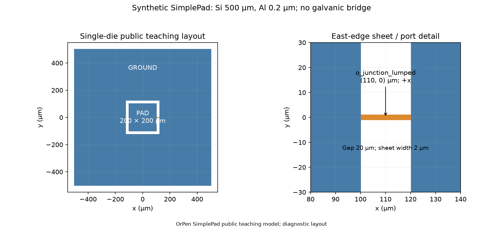
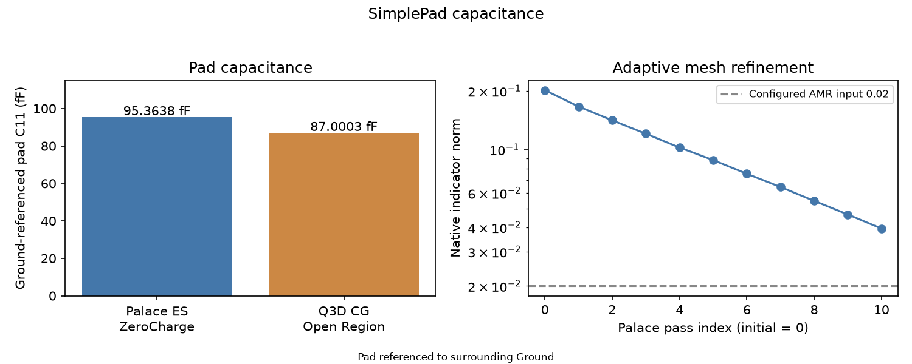

A square metal pad separated from a surrounding ground is a useful first
extraction. The question is **how much charge the pad stores for a specified
voltage relative to ground**. The resulting capacitance belongs to that
geometry, material stack and boundary choice. It is an input to a circuit
model, rather than a complete prediction of a qubit's spectrum.

Start with [installation](../course/installation.qmd). You can run the Python
steps in a script or a notebook. A notebook is convenient for keeping layout,
settings and the result report together; the same SCGSim APIs work without it.

## Prepare the physical model

Use a centered square pad and surrounding Ground on one square die. These are
the declared teaching inputs for both backends:

| Layout or material | Input |
|---|---|
| Single die | 1000 µm × 1000 µm |
| Centered pad | 200 µm × 200 µm |
| Pad-to-Ground gap | Uniform 20 µm around the pad |
| Top metal | Aluminum, 0.2 µm thick |
| Substrate | Silicon, 500 µm thick |

::: {.callout-note title="A simple electrostatic model"}
This model has no second die, backside metal, readout or bumps. Palace
Electrostatic and Q3D omit the inductive branch used in the resonance lesson.
The dimensions and stack are model inputs, not measured capacitance or an
accuracy claim.
:::

Excite the pad relative to Ground. An outer grounded enclosure is a separate
physical assumption. Keep the nominal PDK stack beside the backend's actual
material readback: a native Silicon preset need not match every nominal PDK
material property.

The component and executable notebooks belong to [OrPen SC PDK source
`51985d9`](https://github.com/OrPenStrike/orpen-sc-pdk/tree/51985d9507025e8241205712e866c0b804de29b9). This revision supplies
`square_pad_capacitor` and `get_single_die_layer_stack`; the older Xmon
revision is a separate model. The completed capacitance observations below
show what to locate in the returned report.

{#fig-simple-pad-layout}

Layout image from the [canonical OrPen source](https://github.com/OrPenStrike/orpen-sc-pdk/blob/51985d9507025e8241205712e866c0b804de29b9/notebooks/ComponentSimulation/SimplePad/evidence/layout.png)
at `51985d9`; it depicts the declared model, not a solved field or result.

## Prepare, run and read your first result

Use the canonical SimplePad notebook for the backend you choose. Its cells
already define the component, materials and backend bindings; you edit the
model and run controls rather than rebuilding those bindings for a first run.
The links below open or download the canonical notebooks at the published
OrPen revision. Keep that revision with your model and controls. `OUTPUT_ROOT` is `Path.cwd() / ".artifacts" / "SimplePad"`;
`RUN_ID` names the package below that directory.

:::: {.panel-tabset group="solver"}

### Palace

Choose [palace_electrostatic.ipynb](https://github.com/OrPenStrike/orpen-sc-pdk/blob/51985d9507025e8241205712e866c0b804de29b9/notebooks/ComponentSimulation/SimplePad/palace_electrostatic.ipynb)
([download](https://raw.githubusercontent.com/OrPenStrike/orpen-sc-pdk/51985d9507025e8241205712e866c0b804de29b9/notebooks/ComponentSimulation/SimplePad/palace_electrostatic.ipynb),
[editable QMD](https://github.com/OrPenStrike/orpen-sc-pdk/blob/51985d9507025e8241205712e866c0b804de29b9/notebooks/src/ComponentSimulation/SimplePad/palace_electrostatic.qmd)). It excites the pad relative to Ground with
`EXTERIOR_BOUNDARY_POLICY = "none"`. The mesh controls are
`REFINED_MESH_SIZE_UM = 10.0` and `MAX_MESH_SIZE_UM = 200.0`;
`FEM_ORDER = 2`, `AMR_MAX_PASSES = 10` and `AMR_TOLERANCE = 0.02` set the
numerical request. Fields are saved with `SAVE_FIELDS = 1`.

Its launch controls are `MACHINE_PROFILE = "direct-local"`,
`PALACE_EXECUTABLE = "palace"`, `SETUP_COMMANDS = ("module load palace",)` and
`RESOURCES = {"processes": 8, "threads": 1, "command_style": "wrapper"}`.
Adapt the executable/module and resources to your host.

### AEDT

Choose [aedt_q3d.ipynb](https://github.com/OrPenStrike/orpen-sc-pdk/blob/51985d9507025e8241205712e866c0b804de29b9/notebooks/ComponentSimulation/SimplePad/aedt_q3d.ipynb)
([download](https://raw.githubusercontent.com/OrPenStrike/orpen-sc-pdk/51985d9507025e8241205712e866c0b804de29b9/notebooks/ComponentSimulation/SimplePad/aedt_q3d.ipynb),
[editable QMD](https://github.com/OrPenStrike/orpen-sc-pdk/blob/51985d9507025e8241205712e866c0b804de29b9/notebooks/src/ComponentSimulation/SimplePad/aedt_q3d.qmd)). It requests C/G only:
`EXTRACTION_FREQUENCY_GHZ = 5.0`, `SOLVE_AC_RL = False` and
`GROUNDED_REGION_NET = None`. Keep `MAXIMUM_PASSES = 10` and
`CONVERGENCE_PERCENT = 1.0` beside the extracted matrix.

Its host request uses `AEDT_VERSION = "2024.2"`, `PYAEDT_VERSION = "1.3.0"`
and `RESOURCES = AedtResources(cores=4, ram_limit_percent=80)`. The notebook
maps the PDK superconducting Aluminum to native PEC; the open Q3D Region is
not asserted to be equivalent to Palace's natural exterior.

::::

These are the notebooks' didactic controls, with micrometre mesh lengths and
GHz extraction frequency where stated. They define the requested calculation,
not the accuracy required for your circuit study.

1. In the selected notebook, set `RUN_ID` to a fresh name and choose
   `WORKFLOW_ACTION = "prepare_handoff"`. Execute its preparation cells to
   create `HANDOFF` without starting the solver. Keep its printed run directory;
   for Palace, also retain `HANDOFF.handoff_id` independently.
2. Run the generated script from that directory on the configured solver host:
   `bash run_palace.sh` or `bash run_aedt.sh`. Transfer the complete package
   first if the host is remote. Alternatively, choose `WORKFLOW_ACTION = "run"`
   with a fresh `RUN_ID` and execute the notebook: this action prepares a new
   package and launches its script. It does not resume an already prepared run.
3. Retrieve the complete returned directory. In a fresh notebook kernel, set
   `WORKFLOW_ACTION = "analyze_handoff"` and provide
   `SIMPLE_PAD_RETURNED_RUN_DIR` in the environment. For Palace also provide
   `SIMPLE_PAD_PALACE_HANDOFF_ID` from the independently retained ID. Execute the
   analysis cells to read the actual return and display its report.

The solver executable, host setup and any required license must be available.
The Palace notebook inspects a returned package before resolving a complete
result; an incomplete return remains a partial report. AEDT resolves its
returned package before displaying results. Neither preparation nor a failed
run supplies an invented result.

The analysis displays `result.show_all_results()` (AEDT uses
`show_details=True`), with AEDT matrix rows also available through
`result.physics_results()`.

### Read the pad capacitance

The completed example reports contain these observations:

::: {.table-responsive}

| Calculation | Report entry | Capacitance |
|---|---|---|
| Palace Electrostatic | Ground-referenced pad diagonal, $C_{11}$ | 95.36383731153 fF |
| Q3D, C/G at 5 GHz | Pad row and pad column, $C_{\mathrm{pad,pad}}$ | 87.00027087746 fF |

:::

Reference outputs: SimplePad source `24ae5a4` (the same component/notebook bytes
as the linked public `51985d9` revision), using SCGSim `1.0.1` at `9c032e3`.
Both returned calculations were resolved and displayed through their result
reports. These are observations of this model, not numerical targets for a
new run or a requirement that the backends agree.

{#fig-simple-pad-capacitance}

[Open figure at full size](../assets/simple-pad-capacitance.png)

Read the [public output context](https://github.com/OrPenStrike/orpen-sc-pdk/blob/51985d9507025e8241205712e866c0b804de29b9/notebooks/ComponentSimulation/SimplePad/evidence/README.md) and
[full-precision result rows](https://github.com/OrPenStrike/orpen-sc-pdk/blob/51985d9507025e8241205712e866c0b804de29b9/notebooks/ComponentSimulation/SimplePad/evidence/results.csv) alongside the report.

In the Palace report, locate the driven pad terminal in the ground-referenced
matrix; here its diagonal is $C_{11}$. In Q3D, locate the `pad` row and `pad`
column using the reported conductor order, with `GROUND` assigned as Ground.
Read the units before using a matrix entry: the table above expresses both
observations in femtofarads. Keep the row/column labels when exporting data
rather than assuming that a different model has the same ordering.

Palace uses the natural electrostatic exterior; this Q3D calculation uses an
open Region at 5 GHz. Q3D's native readback identified `PAD` as Signal,
`GROUND` as Ground, Silicon relative permittivity 11.9 and Aluminum represented
as PEC. Keep that readback alongside the nominal PDK material inputs; the shared
layout alone does not make the two field models interchangeable.

Use the notebook analysis cells to display the available report. The manual
Python alternative below exposes the same resolver and report calls when
you work in a script. The pad capacitance can then enter a circuit model for
this geometry. Keep the native status, chosen controls and available changes
with it, and judge the accuracy needed for your intended circuit use.

::: {.callout-tip title="Keep the reference with the number"}
Record which pad was excited and which conductor or boundary was ground. Those
choices are part of the capacitance you extracted, not display preferences.
:::

[Physical problem choices](../concepts/problems.qmd) connect extraction to
circuit quantities. For another matrix representation or a larger conductor
model, use the [Palace](../course/palace-electrostatic.qmd) or
[Q3D](../course/aedt-q3d.qmd) lessons and
[result interpretation](../course/returned-results.qmd#interpret-for-scq-use).

Next, [find a resonance and read participation](resonance-epr.qmd), or
[modify your own source model](../course/working-model.qmd).

## Python API alternative

Use these APIs in a script or notebook when you want to author the setup
yourself. Start with the shared source, then follow only your selected backend
through configuration, handoff and fresh-session resolution.

::::: {.callout-note title="Python setup, bindings and complete result flow" collapse="true"}

## Create the shared source {#create-the-shared-source}

Use the matching SimplePad PDK checkout in the same environment as SCGSim.
Run this common setup, then only the backend tab you choose. The
[resonance lesson](resonance-epr.qmd) reuses this component and its materials.

```python
from pathlib import Path
import gdsfactory as gf
import orpen_sc_pdk
from orpen_sc_pdk import (
    get_material_records, get_interface_preset_records,
    validate_interface_preset_records,
)
from orpen_sc_pdk.tech import LAYER, get_single_die_layer_stack

orpen_sc_pdk.activate()
gf.clear_cache()
component = gf.get_component(
    "square_pad_capacitor", pad_side_um=200.0, gap_um=20.0,
    die_side_um=1000.0, junction_width_um=2.0,
)
layer_stack = get_single_die_layer_stack()
material_records = get_material_records()
output_root = Path(".artifacts/SimplePad")
```

The component owns the pad, surrounding Ground and non-metal port locator.
The locator does not add a conducting bridge or an inductive branch to this
capacitance calculation.

## Configure the extraction

The notebooks use the following didactic controls. Keep them with the result;
they are declared requests, not an accuracy recommendation. Use a fresh run
name for each preparation so it does not replace a previous package.

::: {.panel-tabset group="solver"}

### Palace

Build a GeometryPlan snapshot with explicit Nets and a vacuum envelope. Route B
keeps finite metal geometry. The pad is excited, Ground is fixed, and the
exterior remains natural rather than a grounded enclosure.

```python
from scgsim.sgb import GeometryPlan
from scgsim.palace import ElectrostaticSim

plan = GeometryPlan(
    component=component, root_id="chip", layer_stack=layer_stack,
    material_records=material_records, coupon_padding_um=0.0,
)
plan.set_nets({"pad": ("chip/PAD",), "ground": ("chip/GROUND",)})
plan.set_vacuum_region(padding=(250.0, 250.0, 1000.0))
snapshot = plan.prepare()

run_id = "pad-capacitance-palace-01"
sim = ElectrostaticSim()
sim.set_plan(snapshot)
sim.set_output_dir(output_root / run_id)
presets = validate_interface_preset_records(get_interface_preset_records())
sim.set_surface_epr(
    representation="B",
    specs={kind: {
        **{key: presets[f"LiteratureCentral_{kind}"][key]
           for key in ("thickness", "permittivity", "loss_tangent", "source")},
        "preset": f"LiteratureCentral_{kind}",
    } for kind in ("MA", "MS", "SA")},
)
sim.add_terminal("pad", net_id="pad")
sim.add_ground(net_id="ground")
sim.set_electrostatic(
    save_fields=1, unassigned_conductor_policy="error",
    exterior_boundary_policy="none",
)
sim.set_mesh(refined_mesh_size=10.0, max_mesh_size=200.0)
sim.set_numerical(
    order=2, tolerance=1e-6, max_iterations=2000,
    solver_type="Default", preconditioner="Default", device="CPU",
    amr_max_passes=10, amr_tolerance=0.02, amr_update_fraction=0.15,
    amr_nonconformal=False, save_adapt_iterations=True,
    output_paraview=True, output_grid_function=False,
)
mesh_path = sim.mesh()
config_path = sim.write_config()
```

Mesh sizes and vacuum padding are in micrometres; FEM and AMR controls are
native numerical requests. The MA/MS/SA `LiteratureCentral` records are
attributed model assumptions from the PDK, not measured interface losses.

### AEDT

Q3D takes a positive GDS import and explicit object/Net bindings, rather than
`set_plan`. Separate the canonical pad and connected Ground onto dedicated
import layers; use the PDK stack for their height and the substrate extent.

```python
from scgsim.aedt import (
    AedtResources, LayerImport, ObjectBinding, PdkMaterial,
    Q3dNetSpec, Q3dSpec, MatrixRunControl, prepare_handoff,
)

run_id = "pad-capacitance-q3d-01"
pad_selector = gf.components.rectangle(
    size=(200.0, 200.0), centered=True, layer=LAYER.D0_TOP_M1_DRAW,
)
q3d_geometry = gf.Component()
q3d_geometry << gf.boolean(
    A=component, B=pad_selector, operation="and", layer=(300, 0),
    layer1=LAYER.D0_TOP_M1_DRAW, layer2=LAYER.D0_TOP_M1_DRAW,
)
q3d_geometry << gf.boolean(
    A=component, B=pad_selector, operation="not", layer=(301, 0),
    layer1=LAYER.D0_TOP_M1_DRAW, layer2=LAYER.D0_TOP_M1_DRAW,
)
substrate_geometry = component.extract(layers=[LAYER.D0_SUBSTRATE_AREA])
substrate_geometry.remap_layers({LAYER.D0_SUBSTRATE_AREA: (302, 0)})
q3d_geometry << substrate_geometry
source_gds = output_root / "source_gds" / f"{run_id}.gds"
source_gds.parent.mkdir(parents=True, exist_ok=True)
with source_gds.open("xb") as stream:
    q3d_geometry.write_gds(stream.name, with_metadata=False)

metal = layer_stack.layers["D0_TOP_M1"]
substrate = layer_stack.layers["D0_SUBSTRATE"]
layer_imports = (
    LayerImport(300, 0, "PAD", metal.zmin, metal.zmin + metal.thickness),
    LayerImport(301, 0, "GROUND", metal.zmin, metal.zmin + metal.thickness),
    LayerImport(302, 0, "SUBSTRATE", substrate.zmin,
                substrate.zmin + substrate.thickness),
)
object_bindings = (
    ObjectBinding("PAD_1", 300, "signal", "Al"),
    ObjectBinding("GROUND_2", 301, "ground", "Al"),
    ObjectBinding("SUBSTRATE_3", 302, "substrate", "Si"),
)
materials = {
    name: PdkMaterial(name, material_records[name]["material_kind"],
                      material_records[name]["is_superconducting"],
                      material_records[name]["aedt_library_name"])
    for name in ("Al", "Si", "vacuum")
}
nets = (
    Q3dNetSpec("pad", "Signal", ("PAD_1",), "PAD_1", "-Z", "PAD_1", "+Z"),
    Q3dNetSpec("ground", "Ground", ("GROUND_2",)),
)
spec = Q3dSpec(
    gds_path=source_gds, project_name=run_id, design_name="SimplePadQ3d",
    materials=materials, vacuum_material_id="vacuum",
    layer_imports=layer_imports, object_bindings=object_bindings, nets=nets,
    run_control=MatrixRunControl(
        setup_name="Setup1", frequency_ghz=5.0, maximum_passes=10,
        convergence_percent=1.0,
    ),
    region_padding_um=(250.0, 250.0, 250.0, 250.0, 1000.0, 1000.0),
    solve_ac_rl=False, grounded_region_net=None,
    aedt_version="2024.2", pyaedt_version="1.3.0",
)
handoff = prepare_handoff(
    spec=spec, output_dir=output_root / run_id,
    resources=AedtResources(cores=4, ram_limit_percent=80),
)
```

The request is C/G-only at 5 GHz, with at most 10 adaptive passes and a native
1% target; it does not request AC R/L. Region padding is in micrometres and the
Region is not assigned to a grounded Net. PDK superconducting Al is lowered to
native PEC; this is not a finite-conductivity loss measurement. Natural Palace
exterior and open Q3D Region are not asserted to be equivalent models.

:::

## Execute the prepared model

For Palace, finish the portable handoff after writing its mesh/config:

```python
handoff = sim.prepare_handoff(
    profile="direct-local", executable="palace",
    resources={"processes": 8, "threads": 1, "command_style": "wrapper"},
    setup_commands=("module load palace",),
)
expected_handoff_id = handoff.handoff_id
print(handoff.run_dir, expected_handoff_id)
```

These are the notebook's host launch settings; match the executable/module and
resources to your actual Palace host. Retain the printed preparation ID in
your study notes before transfer. Q3D's tab already creates its handoff.
Preparation does not start either solver. Transfer the complete package if
needed, open its run directory on the host, and run:

::: {.panel-tabset group="solver"}

### Palace

```bash
bash run_palace.sh
```

### AEDT

```bash
bash run_aedt.sh
```

:::

Retrieve the entire returned directory. The native executable, license where
needed, and host environment remain your responsibility. Keep the actual run status and outputs together when reading the result.

## Resolve and display the result

In a fresh analysis session, supply the complete retrieved directory through
`SIMPLE_PAD_RETURNED_RUN_DIR`. For Palace, set `SIMPLE_PAD_PALACE_HANDOFF_ID`
from the ID you retained before execution.

```python
import os
from pathlib import Path
returned_run_dir = Path(os.environ["SIMPLE_PAD_RETURNED_RUN_DIR"])
```

The report is generated from the actual returned directory. Locate the pad
diagonal and conductor identities as described in the reference outputs above.

::: {.panel-tabset group="solver"}

### Palace

```python
from scgsim.palace import resolve_palace_result

expected_handoff_id = os.environ["SIMPLE_PAD_PALACE_HANDOFF_ID"]
result = resolve_palace_result(
    returned_run_dir, expected_handoff_id=expected_handoff_id,
)
result.show_all_results()
```

### AEDT

```python
from scgsim.aedt import resolve_results

result = resolve_results(returned_run_dir)
result.show_all_results(show_details=True)
matrix_rows = result.physics_results()
```

:::

:::::
