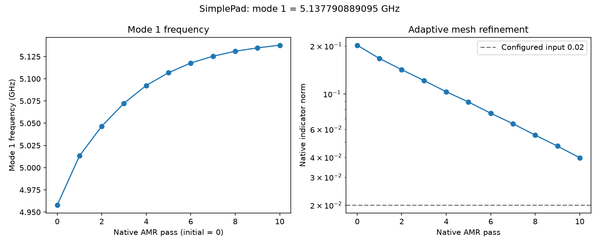
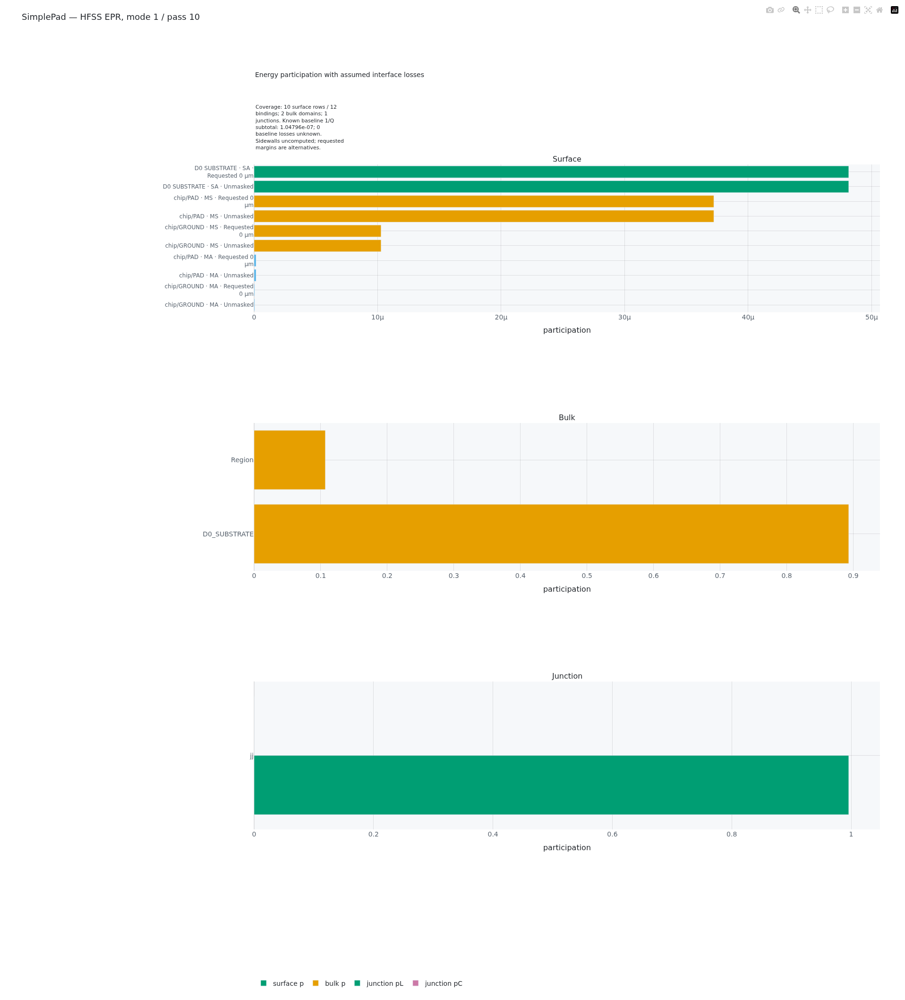

Start from the square pad and surrounding ground in the
[capacitance example](capacitance.qmd). Add an explicit inductive branch between
them. The pad's electric energy and the branch's magnetic energy form a simple
resonator: this lesson finds its mode frequency and reads where that mode's
energy is stored.

Keep the [layout and material inputs](capacitance.qmd#prepare-the-physical-model)
from the capacitance lesson: a centered 200 µm square pad, uniform 20 µm gap,
1000 µm square single die, and 0.2 µm top Aluminum on 500 µm Silicon. For this
Eigenmode model only, add an authored lumped sheet across the east-edge gap:
`x = 100..120 µm`, `y = −1..1 µm`. Use the authored non-metal port rather than recreating a metal bridge. Its linear circuit inputs are **10 nH** and
**C = 0 F**; the capacitance extraction omits this branch.

::: {.callout-note title="A declared linear resonator"}
The sheet represents a lumped inductive branch, not a physical galvanic short
or a measured nonlinear qubit model. There is no second die, backside metal,
readout or bump structure. These inputs define the example, not its numerical
accuracy or a measured device.
:::

Interface-film and bulk-loss values are additional modeling assumptions, rather
than properties inferred from the layout. Keep these values and the backend's
actual material readback with the nominal PDK stack so the EPR report has a
clear physical meaning. [EPR concepts](../eigenmode-epr.qmd) explain surface,
bulk and junction participation when you need the definitions.

Use the [published SimplePad source `51985d9`](https://github.com/OrPenStrike/orpen-sc-pdk/tree/51985d9507025e8241205712e866c0b804de29b9)
and the [shared layout picture](capacitance.qmd#fig-simple-pad-layout).
The notebooks below define the actual model and controls. The reference
observations show the mode frequency and where its energy is stored.

## Prepare, run and read your first result

Use the canonical SimplePad notebook for the backend you choose. Its cells
already define the component, materials and backend bindings; you edit the
model and run controls rather than rebuilding those bindings for a first run.
The links below open or download the canonical notebooks at the published
OrPen revision. Keep that revision with your model and controls. `OUTPUT_ROOT` is `Path.cwd() / ".artifacts" / "SimplePad"`;
`RUN_ID` names the package below that directory.

:::: {.panel-tabset group="solver"}

### Palace

Choose [palace_eigenmode.ipynb](https://github.com/OrPenStrike/orpen-sc-pdk/blob/51985d9507025e8241205712e866c0b804de29b9/notebooks/ComponentSimulation/SimplePad/palace_eigenmode.ipynb)
([download](https://raw.githubusercontent.com/OrPenStrike/orpen-sc-pdk/51985d9507025e8241205712e866c0b804de29b9/notebooks/ComponentSimulation/SimplePad/palace_eigenmode.ipynb),
[editable QMD](https://github.com/OrPenStrike/orpen-sc-pdk/blob/51985d9507025e8241205712e866c0b804de29b9/notebooks/src/ComponentSimulation/SimplePad/palace_eigenmode.qmd)). Its mode controls are `NUM_MODES = 1`,
`SEARCH_FREQUENCY_HZ = 1e9` and `EIGENMODE_TOLERANCE = 1e-6`.
`PORT_INDUCTANCE_H = 10e-9` supplies the authored inductive branch.
Mesh sizes are `REFINED_MESH_SIZE_UM = 10.0` and `MAX_MESH_SIZE_UM = 200.0`;
`FEM_ORDER = 2`, `AMR_MAX_PASSES = 10`, `AMR_TOLERANCE = 0.02` and
`SAVE_FIELDS = 1` configure the numerical request and saved fields.
The exterior uses Palace's natural PMC convention.

The launch controls are `MACHINE_PROFILE = "direct-local"`,
`PALACE_EXECUTABLE = "palace"`, `SETUP_COMMANDS = ("module load palace",)` and
`RESOURCES = {"processes": 8, "threads": 1, "command_style": "wrapper"}`;
adapt the executable/module and resources to your host.

### AEDT

Choose [aedt_hfss_eigenmode.ipynb](https://github.com/OrPenStrike/orpen-sc-pdk/blob/51985d9507025e8241205712e866c0b804de29b9/notebooks/ComponentSimulation/SimplePad/aedt_hfss_eigenmode.ipynb)
([download](https://raw.githubusercontent.com/OrPenStrike/orpen-sc-pdk/51985d9507025e8241205712e866c0b804de29b9/notebooks/ComponentSimulation/SimplePad/aedt_hfss_eigenmode.ipynb),
[editable QMD](https://github.com/OrPenStrike/orpen-sc-pdk/blob/51985d9507025e8241205712e866c0b804de29b9/notebooks/src/ComponentSimulation/SimplePad/aedt_hfss_eigenmode.qmd)). Its controls are `NUM_MODES = 1`,
`SEARCH_FREQUENCY_GHZ = 1.0`, `MAXIMUM_PASSES = 10` and
`CONVERGENCE_PERCENT = 1.0`. The authored junction uses
`PORT_INDUCTANCE_H = 10e-9` and `PORT_CAPACITANCE_F = 0.0`.

The host request uses `AEDT_VERSION = "2024.2"`, `PYAEDT_VERSION = "1.3.0"`
and `RESOURCES = AedtResources(cores=4, ram_limit_percent=80)`. The notebook
makes no explicit outer enclosure assignment; do not infer its implicit
native boundary type from the shared layout.

::::

Both notebooks use Route B and the attributed `LiteratureCentral` interface
assumptions. Search frequency, native stopping controls and loss assumptions
are declared inputs, not a measured resonance or an accuracy recommendation.
The source Route B choice is upstream of AEDT; the preparation below separately
selects `modeling="solid"` for its snapshot's physical stack.

::: {.callout-note title="Plan for the reference run's cost"}
The reference Palace Eigenmode run used 8 MPI processes × 1 OMP thread,
with elapsed time 14,385.602 s (about 4 hours) and reported peak node memory
44,553.406 MB. Use this recorded cost when choosing a host; it is neither a
minimum-resource requirement nor a guarantee of your run's time or memory.
:::

1. In the selected notebook, set `RUN_ID` to a fresh name and choose
   `WORKFLOW_ACTION = "prepare_handoff"`. Execute its preparation cells to
   create `HANDOFF` without starting the solver. Keep its printed run directory;
   for Palace, also retain `HANDOFF.handoff_id` independently.
2. Run the generated script from that directory on the configured solver host:
   `bash run_palace.sh` or `bash run_aedt.sh`. Transfer the complete package
   first if the host is remote. Alternatively, choose `WORKFLOW_ACTION = "run"`
   with a fresh `RUN_ID` and execute the notebook: this action prepares a new
   package and launches its script. It does not resume an already prepared run.
3. Retrieve the complete returned directory. In a fresh notebook kernel, set
   `WORKFLOW_ACTION = "analyze_handoff"` and provide
   `SIMPLE_PAD_RETURNED_RUN_DIR` in the environment. For Palace also provide
   `SIMPLE_PAD_PALACE_HANDOFF_ID` from the independently retained ID. Execute the
   analysis cells to read the actual return and display its report.

The solver executable, host setup and any required license must be available.
The Palace notebook inspects a returned package before resolving a complete
result; an incomplete return remains a partial report. AEDT resolves its
returned package before displaying results. Neither preparation nor a failed
run supplies an invented result.

The analysis displays `result.show_all_results()` (AEDT uses
`show_details=True`); AEDT also exposes `result.physics_results()` and
`result.epr_result()` for the recorded rows.

### Read the mode and its energy

Find **mode 1** and its frequency in GHz, then read the participation beside
its material, interface or circuit-element owner. Participation is
dimensionless. The completed example provides these reference observations,
rounded for reading:

:::: {.panel-tabset group="solver"}

### Palace

| Quantity for mode 1 | Observation |
|---|---|
| Mode frequency | 5.137791 GHz |
| Silicon electric participation | 0.920574 |
| Vacuum electric participation | 0.079426 |
| Authored port, native signed participation | 0.993926 |

The returned report also contains eight native MA/MS/SA interface rows with
side identity. Keep each interface and side label with its contribution;
a single surface number would hide which film the field samples.

{#fig-simple-pad-palace-em}

[Open figure at full size](../assets/simple-pad-palace-em.png)

### AEDT

| Quantity for mode 1 | Observation |
|---|---|
| Mode frequency | 4.879060 GHz |
| Silicon electric participation | 0.893092 |
| Vacuum electric participation | 0.106908 |
| Junction `jj`, inductive energy ratio $p_L$ | 0.995816 |
| Junction `jj`, capacitive energy ratio $p_C$ | 0 |

The HFSS participation values come from the separate candidate EPR analysis
of the existing native solution described below. Five unmasked interface
contributions retain their owner and interface labels. The requested 0 µm
mask is an alternative estimate, not another band to add to the baseline.

{#fig-simple-pad-hfss-epr}

[Open figure at full size](../assets/simple-pad-hfss-epr.png)

::::

The bulk rows show that most electric energy lies in Silicon for these models.
The port/junction rows describe the authored linear branch. Palace's native
signed port participation and HFSS's nonnegative inductive/capacitive energy
ratios have different definitions; do not treat them as interchangeable
junction measurements. The frequencies belong to the declared linear models,
not a measured qubit transition or nonlinear $f_{01}$.

For a loss interpretation, read the selected interface participation with its
film thickness, permittivity and loss tangent. The `LiteratureCentral` films,
including their 2 nm modeling thickness, are synthetic assumptions. Keep the
unmasked baseline and each alternative mask separate. HFSS sidewall film
energy remains uncomputed. Native solver Q and a known-loss subtotal derived
from these selected channels answer different questions; neither establishes
a full physical device Q or $T_1$.

Use the public [reference quantities](https://github.com/OrPenStrike/orpen-sc-pdk/blob/51985d9507025e8241205712e866c0b804de29b9/notebooks/ComponentSimulation/SimplePad/evidence/results.csv),
[Palace surface rows](https://github.com/OrPenStrike/orpen-sc-pdk/blob/51985d9507025e8241205712e866c0b804de29b9/notebooks/ComponentSimulation/SimplePad/evidence/surface_epr.csv) and
[HFSS participation rows](https://github.com/OrPenStrike/orpen-sc-pdk/blob/51985d9507025e8241205712e866c0b804de29b9/notebooks/ComponentSimulation/SimplePad/evidence/hfss_epr.csv) for full-precision data.
The [output context](https://github.com/OrPenStrike/orpen-sc-pdk/blob/51985d9507025e8241205712e866c0b804de29b9/notebooks/ComponentSimulation/SimplePad/evidence/README.md) explains their original and derived stages.

::: {.callout-note title="Reference output context" collapse="true"}
The original mode calculations used SCGSim `1.0.1` at `9c032e3` and SimplePad
source `24ae5a4`, whose component/notebook bytes match the linked `51985d9`
revision. Palace's completed return was resolved with its expected handoff
identity and displayed in the report. HFSS's original returned-result report
contains the mode frequency; its original EPR remains partial.

The HFSS participation table uses a separate SCGSim `1.0.2rc1` derivation on
that existing solution. All ten adaptive-pass EPR records were completed;
the detached `resolve_epr_result`, `plot_epr_result` and `show_epr` paths read
and displayed that derived result. This performed no new Analyze/solve and
did not regenerate the original ordinary strict return receipt or change its
native status. The manual ordinary-return calls below retain their own scope;
they do not replace the original partial EPR with this separate result.

These values are observations, not numerical targets, an accuracy criterion
or a requirement that the two backends agree. Their exterior field models
remain distinct. [EPR concepts](../eigenmode-epr.qmd) explain the normalization
and known-loss scope; the [AEDT EPR reference](../specs/aedt-runtime.qmd#public-epr-candidate-surface)
explains the detached public result interface.
:::


::: {.callout-tip title="Read the quantity your study needs"}
For a frequency study, inspect that mode's frequency and available changes.
For a loss study, inspect the relevant participation as well. Keep the native
status and chosen controls beside those observations; a frequency trend alone
does not describe the change in every EPR contribution.
:::

Next [modify your model](../course/working-model.qmd). The deeper
[Palace EPR](../tutorial-xmon-palace.qmd) and
[HFSS EPR](../tutorial-xmon-aedt.qmd) examples explain interface selection and
source bindings. Use [saved-field analysis](../course/aedt-saved-fields.qmd)
for new native field evaluations or [offline reanalysis](../course/offline-epr.qmd)
for changing loss assumptions on recorded EPR evidence.

## Python API alternative

Use these APIs in a script or notebook when you want to author the setup
yourself. Start with the shared source, then follow only your selected backend
through configuration, handoff and fresh-session resolution.

::::: {.callout-note title="Python setup, bindings and complete result flow" collapse="true"}

## Prepare the shared geometry

Run the [common component setup](capacitance.qmd#create-the-shared-source) in
your preparation session. It defines `component`, `layer_stack`,
`material_records` and `output_root`. Both Eigenmode backends then consume the
same named GeometryPlan snapshot:

```python
from scgsim.geometry import GeometryPlan

plan = GeometryPlan(
    component=component, root_id="chip", layer_stack=layer_stack,
    material_records=material_records, coupon_padding_um=0.0,
)
plan.set_nets({"pad": ("chip/PAD",), "ground": ("chip/GROUND",)})
plan.set_vacuum_region(padding=(250.0, 250.0, 1000.0))
snapshot = plan.prepare()
presets = validate_interface_preset_records(get_interface_preset_records())
```

The non-metal locator extends one source database unit onto each terminal
(`x = 99.999..120.001 µm`) for binding; the physical gap remains 20 µm.
Padding is in micrometres. `LiteratureCentral_MA`, `_MS` and `_SA` are
attributed interface assumptions from the PDK, not measured loss data.

## Configure the mode calculation

The canonical notebooks request one mode with a 1 GHz search input and a
10 nH inductive branch. Choose one backend; keep these controls and its actual
native observations with the mode you interpret. Use a new run name for each
preparation.

::: {.panel-tabset group="solver"}

### Palace

```python
from scgsim.palace import EigenmodeSim

run_id = "pad-resonance-palace-01"
sim = EigenmodeSim()
sim.set_plan(snapshot)
sim.set_output_dir(output_root / run_id)
sim.set_surface_epr(
    representation="B",
    specs={kind: {
        **{key: presets[f"LiteratureCentral_{kind}"][key]
           for key in ("thickness", "permittivity", "loss_tangent", "source")},
        "preset": f"LiteratureCentral_{kind}",
    } for kind in ("MA", "MS", "SA")},
)
port_name = "chip/o_junction_lumped"
sim.add_port(
    port_name, layer="D0_TOP_M1", layout_sheet=True, inductance=10e-9,
)
sim.set_epr_request(
    surface_interfaces=("MA", "MS", "SA"),
    bulk_domain_ids=None, port_names=(port_name,),
)
sim.set_eigenmode(num_modes=1, target=1e9, tolerance=1e-6, save=1)
sim.set_mesh(refined_mesh_size=10.0, max_mesh_size=200.0)
sim.set_numerical(
    order=2, tolerance=1e-6, max_iterations=2000,
    solver_type="Default", preconditioner="Default", device="CPU",
    amr_max_passes=10, amr_tolerance=0.02, amr_update_fraction=0.15,
    amr_nonconformal=False, save_adapt_iterations=True,
    output_paraview=True, output_grid_function=False,
)
mesh_path = sim.mesh()
config_path = sim.write_config()
```

The port inductance is in henries, search target in hertz and mesh sizes in
micrometres. Palace's port API is inductive-only; C = 0 does not add a
capacitive branch. The unspecified exterior uses Palace's natural PMC
convention. Surface, bulk and port quantities remain separate in the report.

### AEDT

HFSS uses the authored port to build a junction-aware source catalogue. The
interface records below bind each requested film to that prepared source;
the notebook owns the full setup rather than a second source parser here.

```python
from scgsim.aedt import (
    AedtResources, EigenmodeSim, EigenmodeRunControl, EprAnalysisRequest,
    SurfaceEprSpec, planar_junction_from_port, prepare_planar_geometry_input,
)

run_id = "pad-resonance-hfss-01"
junction = planar_junction_from_port(
    snapshot.geometry_input, port_name="chip/o_junction_lumped",
    junction_id="jj", terminal_a_net="pad", terminal_b_net="ground",
    inductance_h=10e-9, capacitance_f=0.0,
)
prepared = prepare_planar_geometry_input(
    snapshot.geometry_input, prepared_stack=snapshot.stack,
    modeling="solid", junctions=(junction,),
)
surface_specs = []
for record in prepared.contribution_catalog:
    kind = record["interface_kind"]
    if kind not in ("MA", "MS", "SA"):
        continue
    preset_name = f"LiteratureCentral_{kind}"
    preset = presets[preset_name]
    surface_specs.append(SurfaceEprSpec(
        contribution_id=record["contribution_id"],
        source_polygon_id=record["source_polygon_ids"][0],
        interface_kind=kind, field_side=record["field_side"],
        margins_um=(0.0,), film_thickness_m=preset["thickness"] * 1e-6,
        film_relative_permittivity=preset["permittivity"],
        loss_tangent=preset["loss_tangent"], source=preset["source"],
        preset=preset_name,
    ))
sim = EigenmodeSim(modeling="solid")
sim.set_plan(snapshot)
sim.set_output_dir(output_root / run_id)
sim.set_surface_epr(contributions=surface_specs)
sim.add_junction(junction)
sim.set_epr_request(EprAnalysisRequest(
    mode_indices=(1,),
    surface_contribution_ids=tuple(item.contribution_id for item in surface_specs),
    junction_ids=("jj",), bulk_domain_ids=None,
))
sim.set_eigenmode(
    project_name=run_id, design_name="SimplePadEigenmode",
    run_control=EigenmodeRunControl(
        setup_name="Setup1", minimum_frequency_ghz=1.0, num_modes=1,
        maximum_passes=10, maximum_delta_frequency_percent=1.0,
    ),
    resources=AedtResources(cores=4, ram_limit_percent=80),
)
handoff = sim.prepare_handoff()
```

The film thickness is converted from PDK micrometres to metres; the native
frequency request is in GHz. The request retains all configured bulk domains
and the authored junction alongside the selected interface contributions. This
is HFSS Eigenmode/EPR, rather than ordinary mode-only HFSS. The notebook uses
AEDT 2024.2/PyAEDT 1.3.0 and makes no explicit outer enclosure assignment;
do not infer its implicit native boundary type or backend equivalence from
shared layout alone. Ten passes and the native 1% delta-frequency target are
controls, not proof that a quantity is adequate for your study.

:::

## Execute the calculation

After writing the Palace mesh/config, create its handoff using the notebook's
launch shape, adapted to your actual solver host:

```python
handoff = sim.prepare_handoff(
    profile="direct-local", executable="palace",
    resources={"processes": 8, "threads": 1, "command_style": "wrapper"},
    setup_commands=("module load palace",),
)
expected_handoff_id = handoff.handoff_id
print(handoff.run_dir, expected_handoff_id)
```

Keep the preparation ID independently before transfer. The AEDT tab already
prepares its package. Transfer the complete handoff when the solver is on
another computer, then run from its extracted run directory:

::: {.panel-tabset group="solver"}

### Palace

```bash
bash run_palace.sh
```

### AEDT

```bash
bash run_aedt.sh
```

:::

Retrieve the whole returned directory after the run. The
[execution lesson](../course/execute.qmd) describes host setup and remote/Slurm
use. The Python preparation steps do not start the native solver.

## Display the mode and participation

Open a fresh analysis session and set `SIMPLE_PAD_RETURNED_RUN_DIR` to the
complete retrieved package. For Palace, set `SIMPLE_PAD_PALACE_HANDOFF_ID` from
your independently retained preparation ID.

```python
import os
from pathlib import Path
returned_run_dir = Path(os.environ["SIMPLE_PAD_RETURNED_RUN_DIR"])
```

Read the mode and participation owners as described in the reference outputs
above. The ordinary returned-result report and a separately derived EPR result
retain their distinct identities.

::: {.panel-tabset group="solver"}

### Palace

```python
from scgsim.palace import resolve_palace_result

expected_handoff_id = os.environ["SIMPLE_PAD_PALACE_HANDOFF_ID"]
result = resolve_palace_result(
    returned_run_dir, expected_handoff_id=expected_handoff_id,
)
result.show_all_results()
```

### AEDT

```python
from scgsim.aedt import resolve_results

result = resolve_results(returned_run_dir)
result.show_all_results(show_details=True)
physics_rows = result.physics_results()
epr_rows = result.epr_result()
```

:::

:::::
